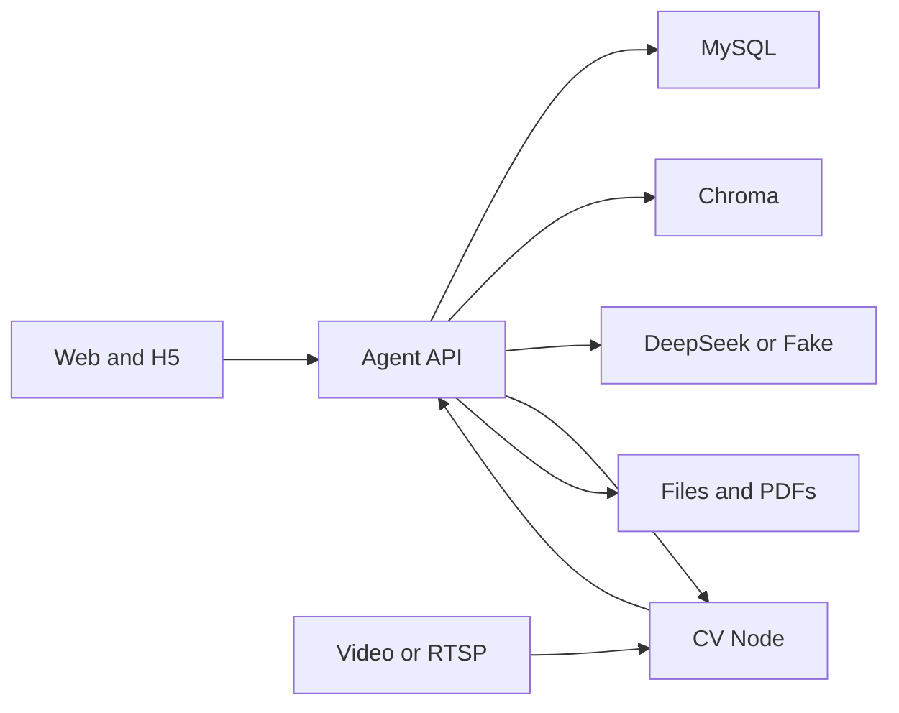

# 智慧施工安全智能体：项目功能与 Agent 工具总览

> 依据当前仓库代码整理，更新日期：2026-10-10。本文描述已经接入的功能与代码边界；能否实际使用还取决于数据库迁移、模型与向量库配置、CV 节点及网络可达性。文中的“Agent 工具”特指聊天图向模型提供的工具目录，不等同于所有 FastAPI 接口。

## 1. 项目定位与架构

本项目把施工现场视频感知、结构化违规事件、摄像头管理、危险区域标定、事故案例与工程规范知识库、整改闭环和安全教育放在同一套系统内。主要面向现场安全管理人员；培训发布后，工人可通过独立的 H5 页面阅读材料并答题。

| 层 | 实现 | 主要职责 |
| --- | --- | --- |
| Web | Vue 3、TypeScript、Vite、Element Plus、ECharts、Konva | 监控、事件、整改、标定、聊天、学习中心与工人答题界面 |
| Agent API | FastAPI、Pydantic、SQLAlchemy、Alembic | 业务接口、工具编排、待确认写操作、知识库与学习任务 |
| Agent 模型 | LangGraph、DeepSeek 兼容接口；可切换 Fake 适配器 | 选择工具、生成回答、报告、教育建议和培训材料 |
| 数据 | MySQL；ChromaDB；本地文档、快照和 PDF | 业务记录、向量索引及文件存储 |
| CV 节点 | PyTorch、Ultralytics、OpenCV、跟踪和本地控制 API | 解码视频、检测人员与安全帽、判断危险区域、发布事件和状态 |

图中 Web and H5 分别是管理端和工人学习页；Chroma 保存事故报告与规范的独立向量集合；CV Node 从视频文件或 RTSP 获取画面，并向 Agent API 回传违规事件、摄像头状态和节点心跳；Files and PDFs 包含本地文档、快照与报告 PDF。

关键代码入口：`agent/main.py` 装配服务与路由；`agent/services/chat_service.py` 准备会话与规范上下文；`agent/graph/chat_graph.py` 编排工具；`agent/services/agent_write_actions.py` 管理写操作；`agent/services/learning_service.py` 实现学习中心；`perception/control_api.py` 提供 CV 节点控制；`web/src/router/index.ts` 定义页面。

## 2. Agent 的回答与工具调用机制

1. 浏览器向 `POST /api/v1/agent/chat` 提交问题及 `conversation_id`。后端读取 MySQL 中尚未过期的短期会话上下文。
2. 如果启用 RAG，**每轮**先按当前问题自动检索工程规范片段，形成回答上下文；事故报告不在这个自动步骤中，只有模型选择 `search_knowledge` 时才检索。规范检索失败时会标记降级，不允许据此编造标准。
3. 模型只能从运行时提供的工具目录选择工具，并提交符合 `ToolDecision` 的结构化参数。图根据返回结果最多执行 `AGENT_TOOL_MAX_CALLS` 次工具调用，配置只允许 1～2 次。无必要工具时直接回答。
4. 查询结果可附事件证据、知识片段出处、报告或培训预览卡片、工具调用轨迹。回答中出现无法由规范片段支持的标准名称、编号或条款时，服务会拒绝该回答。
5. 写工具只**创建服务端待确认操作**；浏览器另行调用确认或取消接口后，才执行数据库写入或 CV 控制。待确认操作绑定页面会话，默认 15 分钟过期，执行过程留有审计记录。

注意：聊天图动态加入部分工具。基础安全查询始终注册；学习工具在 `LearningService` 可用时注册；知识工具在 RAG 可用时出现；写工具依赖写操作服务。下表按完整服务装配后的目录统计，共 **30 个 Agent 工具**：只读查询 15 个、只读引导 3 个、需确认的写工具 12 个。其中基础查询 6 个和学习查询 7 个由 `ToolRegistry` 注册，其余由聊天图加入目录并分派执行。

### 2.1 现场安全查询工具（6 个）

| 工具名 | 作用 | 主要输入 / 返回 |
| --- | --- | --- |
| `query_violations` | 查询已入库违规事件明细 | `query` 中可设摄像头、违规类型、严重级别、状态、UTC 起止时间、分页；返回事件与快照地址 |
| `get_violation_statistics` | 汇总违规数量、类型、严重程度和平均持续时间 | `query`；返回统计结构 |
| `get_camera_status` | 查询指定摄像头最近上报状态 | 必须提供真实 `camera_id`；返回在线状态、FPS、帧号、人数等；未找到时为空 |
| `get_all_camera_statuses` | 列出已知摄像头的最近状态 | 无输入；返回各摄像头状态 |
| `get_workforce_summary` | 汇总在线摄像头上报的活跃作业人数 | 无输入；**不做跨摄像头人员去重** |
| `get_current_weather` | 查询指定地点当前天气 | 必须提供地点；依赖外部天气数据源 |

聊天查询的 `query.limit` 最大 100 条，时间跨度最大 31 天。`get_camera_status` 使用数据库中的最新上报状态；过期状态是否视为离线，由仓储中的时效判断决定，并不等同于预览流是否可播放。

### 2.2 知识查询工具（2 个）

| 工具名 | 作用 | 边界 |
| --- | --- | --- |
| `search_knowledge` | 根据问题检索事故报告片段并给出引用 | 输入 `knowledge_query`、`top_k`；仅检索 `ACCIDENT_REPORT`；模型需按需调用 |
| `list_standard_catalog` | 列出规范收件箱的文档名、索引状态与有效性 | 适用于“库里有哪些规范”；读取目录/元数据，不代替每轮自动规范 RAG |

`search_knowledge` 和自动规范检索分别走不同的向量集合。`SUPERSEDED` 规范不参与常规检索；`UNKNOWN` 只能作为待核实资料引用，不得称为现行标准。扫描版 PDF 无可提取文本时可能显示“需 OCR”，在补充可检索文本前无法作为依据。

### 2.3 学习中心只读工具（7 个）

| 工具名 | 作用 | 主要输入 / 返回 |
| --- | --- | --- |
| `get_learning_overview` | 读取本周事件、高风险事件、主要风险及培训完成情况 | 无输入；基于当前数据库统计 |
| `get_learning_insights` | 读取本周风险关联的推荐事故案例和 AI 教育建议 | 无输入；教育建议在进程内短期缓存 |
| `list_safety_reports` | 列出最近报告的真实 ID、周期、状态、事件数、摘要及 PDF 地址 | 无输入；用于先找到报告 |
| `get_safety_report` | 读取指定报告的统计、正文和引用 | 必须提供 `report_id` |
| `list_training_tasks` | 列出培训任务 ID、来源报告、标题、状态、人数及材料摘要 | 无输入；用于先找到培训 |
| `get_training_task` | 读取培训材料、题目、引用文档及学习地址 | 必须提供 `training_id` |
| `get_training_statistics` | 读取目标人数、完成数、完成率、平均分、及格率和答题记录 | 必须提供 `training_id`；Agent 工具只返回最近 20 条记录 |

聊天回复把报告和培训作为可点击的预览卡片展示，而不是只返回内部 API 路径；列表最多展示 10 张卡片，其余可到学习中心查看。

### 2.4 参数不全时的只读引导工具（3 个）

| 工具名 | 用途 | 页面后续动作 |
| --- | --- | --- |
| `list_rectification_targets` | 读取最多 8 条活动违规，供创建整改任务选目标 | 选择违规后填写要求、负责人和截止时间 |
| `list_monitoring_targets` | 读取已登记摄像头，供启停监控选择 | 选择摄像头后继续生成待确认操作；需 `selection_action=start/stop` |
| `prepare_training_task` | 用户要求生成培训但未给齐报告、标题、人数时，列出最近已确认报告 | 选报告并填写主题、目标人数、题数和及格分；页面提交后进入待确认流程 |

如果没有已确认报告，培训引导会提示先生成并确认报告。引导工具只返回真实候选项，不自行猜测 ID。

### 2.5 整改与监控写工具（4 个）

| 工具名 | 待确认操作 | 必要信息 / 执行效果 |
| --- | --- | --- |
| `create_rectification_task` | 创建整改任务 | 真实违规事件 UUID、标题、负责人、UTC 截止时间；可附说明 |
| `update_rectification_task` | 更新整改任务 | 真实任务 ID，且至少提供负责人、截止时间、状态或备注之一；完成任务时关联违规同步标记已解决 |
| `start_monitoring` | 启动摄像头监控 | 真实 `camera_id`；确认后由 Agent 通过私有控制 API 请求对应 CV 节点 |
| `stop_monitoring` | 停止摄像头监控 | 真实 `camera_id`；确认后停止 CV 会话并更新期望状态 |

整改任务的 `COMPLETED`、`CANCELLED` 是终态，不能再次编辑。Agent 提议中不会把摄像头视频源地址或控制令牌传给浏览器。

### 2.6 报告与培训写工具（8 个）

| 工具名 | 待确认操作 | 前置条件或结果 |
| --- | --- | --- |
| `create_safety_report` | 生成安全报告草稿 | 未指定周期时默认本周；可传 `report_period=THIS_WEEK` 或明确的 UTC 起止时间；确认后查询 MySQL、检索规范并让模型生成正文 |
| `update_safety_report` | 修改报告正文 | 需要草稿报告 ID；可更新总结、风险分析、整改建议中的至少一项 |
| `confirm_safety_report` | 确认报告并生成 PDF | 仅草稿可确认；确认后可下载 PDF |
| `delete_safety_report` | 删除报告及其 PDF | 草稿与已确认报告均可删除；若有关联培训，须先删除培训 |
| `create_training_task` | 生成培训材料与选择题草稿 | 需要**已确认**报告 ID、标题、目标人数；可选文档 ID、题数、及格分 |
| `update_training_task` | 修改培训草稿 | 需要任务 ID；可改标题、人数、及格分、材料或题目；仅草稿可改 |
| `publish_training_task` | 发布培训任务 | 仅草稿可发布；生成工人学习地址及二维码 |
| `delete_training_task` | 删除培训任务 | 草稿和已发布任务均可删除；发布任务删除后链接失效，答题记录与成绩一并删除 |

所有写工具均经 `AgentWriteActionService` 生成 `PendingActionResponse`。对话中说“生成报告”只会先出现待确认卡片；必须点击确认才真正生成草稿。培训引导表单通过 `POST /api/v1/agent/learning/training/propose` 创建同一种待确认操作。用户在学习中心页面直接点击生成或修改，则调用学习中心 API；这是**页面业务操作**，不能与 Agent 工具的确认机制混为一谈。

## 3. 系统页面与用户可见功能

| 页面 | 路由 | 已实现功能 |
| --- | --- | --- |
| 现场总览 | `/dashboard` | 摄像头在线数、今日违规、活动事件、视频墙；单/四/六屏、状态和名称筛选、专注/全屏、违规类型与严重程度图表 |
| 违规事件中心 | `/violations` | 按摄像头、违规类型、严重程度、状态、时间筛选；分页查看事件与证据快照 |
| 整改任务中心 | `/rectification-tasks` | 任务筛选、关联活动违规创建、修改/完成/取消、详情、违规证据与操作审计；业务写入前生成确认项 |
| 危险区域标定 | `/zones` | 选择摄像头，以视频帧或网格为背景绘制和拖拽多边形；按原始帧坐标保存配置，处理版本冲突 |
| 摄像头与 CV 节点 | `/cameras` | 登记节点与摄像头、选择节点可访问的视频文件或配置 RTSP、修改视频源、启停监控、查看状态和预览 |
| 安全智能助手 | `/copilot` | 自然语言查询、证据/引用/工具轨迹、引导选择、待确认操作、报告与培训预览及详情 |
| 学习中心 | `/learning` | 本周教育概览、推荐案例、事故案例/规范检索、AI 教育建议、报告与培训历史、上传和管理资料 |
| 工人学习页 | `/learn/:token` | 通过发布链接阅读材料、填写身份、完成单选题并提交；返回分数与及格结果 |

### 3.1 视频感知与事件流

- CV 控制节点负责本地视频路径解释和实时会话。视频源支持 `file`、`rtsp`；文件浏览只限 `CV_ALLOWED_MEDIA_ROOTS`，浏览器不直接访问 CV 控制服务。
- 感知流水线包含目标检测、人员跟踪、安全帽状态、危险区域几何判断、违规事件生命周期及标注帧输出。事件类型为 `NO_HELMET`、`DANGER_ZONE_INTRUSION`、`DWELL_TIMEOUT`；严重级别为 `INFO`、`WARNING`、`CRITICAL`。
- 节点通过内部事件接口上报违规、摄像头状态及心跳。Agent 持久化结构化事件，并通过 `/media` 暴露已生成的快照。对外查询与仪表盘只读取 Agent 数据。
- CV 节点带有本地事件存储与待发送队列；向 Agent 发布事件失败时可以保留待补发记录。危险区域配置由 Agent 按摄像头维护，CV 节点可从内部接口拉取。事件状态区分 `ACTIVE`、`RESOLVED`、`FALSE_ALARM`，报表会排除误报。
- Agent 代理 MJPEG 与单帧 JPEG 预览；标定页面可暂停到最新帧。节点恢复时，Agent 会尝试按已保存的期望状态恢复监控。
- 在线判断依赖最近状态上报的时效，不应把“曾有最后一帧”直接理解为摄像头当前在线。

### 3.2 知识库与 RAG

| 资料类型 | 收件箱默认路径 | 向量集合 | Agent 使用方式 |
| --- | --- | --- | --- |
| 事故报告 `ACCIDENT_REPORT` | `runs/knowledge/inbox/accident_reports/` | 事故报告集合 | `search_knowledge` 按需检索；学习中心推荐案例与案例解读也使用 |
| 工程规范 `STANDARD` | `runs/knowledge/inbox/standards/` | 独立 `standards` 集合 | 每轮回答前自动检索并注入规范上下文；报告、培训和教育建议也检索 |

两个子目录名称通过 `AGENT_RAG_ACCIDENT_REPORTS_SUBDIRECTORY`、`AGENT_RAG_STANDARDS_SUBDIRECTORY` 配置；只扫描这些目录及其子目录。`RagManager` 复用 PDF、DOCX、Markdown、TXT 的文本提取、分块、Embedding、版本向量替换与检索。规范按页/章节保留定位，事故报告按文本段落索引；片段保存标题、来源、类型、版本、页/章节、片段 ID 等元数据。

文档可通过学习中心拖拽上传并指定类型，也可放入对应收件箱等待周期同步。知识管理 API 还支持列举文档与版本、更新日期/风险标签/来源/摘要、重新生成摘要、重新分类、设置规范有效性、停用、重新激活与重建索引。上传时未填摘要，索引成功后会尝试用模型依据原文生成；旧的空摘要由后台逐批补齐，人工摘要不会被自动覆盖。文档状态与索引任务、审计记录保存在 MySQL；Chroma 索引可从已保存原文重建。

规范有效性由管理员明确维护：`CURRENT` 现行、`SUPERSEDED` 废止或被替代、`UNKNOWN` 未核实；系统不靠文件名推断。回答和学习生成会校验明确的规范名称/条款是否出现在提供的依据里，但这属于文本依据检查，不代替人工核对标准的真实适用性。

### 3.3 学习中心业务流程

1. **概览与建议**：从 MySQL 实时汇总本周违规、高风险事件、主要风险、培训目标与完成情况。推荐案例和 AI 教育建议另行加载，在进程内按本周风险缓存；`LEARNING_INSIGHTS_TTL_SECONDS` 默认 600 秒，页面可强制刷新。
2. **安全报告**：对指定的半开区间 `[开始 UTC, 结束 UTC)` 统计事件；排除 `FALSE_ALARM`；统计类型、严重程度、区域及重复出现次数。重复口径是同摄像头、同区域、同违规类型的再次出现，**不是人员去重或同一人重复违规**。模型结合统计和可用规范生成总结、风险分析、整改建议。草稿可编辑；确认后使用 WeasyPrint 模板生成 PDF。
3. **资料与案例**：按文本、风险类型、类型和时间检索文档；事故案例详情可基于原文片段生成经过、原因、风险点和防范措施；规范详情可查看原文片段和有效性。上传资料可补日期、风险标签、来源和摘要。
4. **培训任务**：以已确认报告为基础，可选择最多 10 份事故案例或规范；模型生成学习材料和 1～20 道单选题。出题提示词要求具体施工情境、可追溯依据，避免考查统计次数和系统枚举代码。草稿可人工校对、编辑材料及答案；发布后生成学习链接和二维码，已发布任务不能再编辑草稿。
5. **工人学习与统计**：工人打开 `/learn/:token` 阅读并答题，按工号和姓名提交；同一工号对同一任务只能提交一次。服务端按正确题数算百分制成绩，保存答题与及格结果；管理端查看完成率、平均分、及格率及提交明细。

`LEARNING_PUBLIC_BASE_URL` 决定二维码中的前端地址。`127.0.0.1` 仅对打开网页的那台设备有效；手机扫码需要手机可访问的局域网地址，同时前端 API 地址也必须能从手机访问。

## 4. 主要接口分组

下表概括公开的业务接口族；具体请求字段以 `agent/contracts/` 和 FastAPI 自动生成的 `/docs` 为准。**这里的 `/docs` 是运行时 API 文档地址，与仓库 `docs/` 目录不是同一对象。**

| 接口族 | 主要用途 |
| --- | --- |
| `/api/v1/agent/chat`、`/api/v1/agent/actions/{id}/confirm|cancel` | Agent 问答、待确认操作执行或取消 |
| `/api/v1/agent/learning/training/propose` | 培训引导表单创建待确认操作 |
| `/api/v1/cameras`、`/api/v1/violations`、`/api/v1/violations/statistics` | 摄像头最近状态、事件分页和统计 |
| `/api/v1/agent/safety-query` | 按结构化操作类型执行违规、统计或摄像头状态查询 |
| `/api/v1/cv-nodes`、`/api/v1/managed-cameras`、`/api/v1/cameras/{id}/monitoring:start|stop` | 节点及摄像头登记、视频源配置、监控控制 |
| `/api/v1/cameras/{id}/preview`、`/preview.jpg`、`/zones` | 预览代理与危险区域配置 |
| `/api/v1/rectification-tasks` | 整改列表、详情与待确认创建/更新 |
| `/api/v1/knowledge/documents`、`/api/v1/knowledge/index-jobs` | 文档上传、版本/元数据/有效性/索引任务管理 |
| `/api/v1/learning/overview`、`/overview/insights` | 本周概览与 AI 建议 |
| `/api/v1/learning/reports`、`/documents`、`/training` | 报告、学习资料、培训任务及其详情和管理操作 |
| `/api/v1/learn/{token}`、`/submissions` | 工人公开学习内容及答题提交 |
| `/api/v1/agent/ui-config`、`/api/v1/admin/agent/ui-config` | 读取或更新助手名称、展示选项等页面配置 |
| `/internal/v1/perception/*`、`/internal/v1/cv-nodes/*` | CV 到 Agent 的内部事件、状态、配置和心跳 |

摄像头、CV 节点、学习中心与知识文档的本地管理接口当前不使用管理员令牌；CV 内部通信仍要求内部或节点令牌。视频源和控制令牌在 Agent 侧加密存储，不返回前端。工人答题依赖发布后的访问令牌链接，发布前没有公开学习页。

## 5. 关键配置与运行边界

| 配置组 | 关键变量 | 用途 |
| --- | --- | --- |
| 数据库与 API | `AGENT_DATABASE_URL`、`AGENT_BIND_HOST`、`AGENT_PORT`、`AGENT_CORS_ORIGINS` | MySQL 连接、监听与浏览器跨域 |
| 模型与工具 | `AGENT_LLM_PROVIDER`、`AGENT_LLM_MODEL`、`AGENT_LLM_API_KEY`、`AGENT_TOOL_MAX_CALLS` | DeepSeek/Fake 选择、工具步数 |
| 会话 | `AGENT_MEMORY_ENABLED`、`AGENT_MEMORY_TTL_HOURS`、`AGENT_MEMORY_RECENT_TURNS` | 短期记忆及保留策略 |
| 知识库 | `AGENT_RAG_ENABLED`、`AGENT_RAG_INBOX_DIRECTORY`、两个子目录配置、Embedding 配置、`AGENT_RAG_SYNC_INTERVAL_SECONDS` | 文档扫描、向量化与检索 |
| 摄像头与媒体 | `AGENT_CREDENTIAL_ENCRYPTION_KEY`、`CV_ALLOWED_MEDIA_ROOTS`、`AGENT_MEDIA_ROOT`、`CV_SNAPSHOT_DIR` | 凭据保护、文件白名单与快照共享目录 |
| 学习中心 | `LEARNING_REPORT_DIRECTORY`、`LEARNING_TIMEZONE`、`LEARNING_PUBLIC_BASE_URL`、`LEARNING_INSIGHTS_TTL_SECONDS` | PDF、统计时区、二维码地址与建议缓存 |
| 前端 | `VITE_API_BASE_URL`、`VITE_DEV_API_TARGET`、`VITE_LEARNING_TIMEZONE` | API 地址、开发代理与显示时区 |

完整安装和启动步骤见仓库根目录 [`README.md`](../README.md)。数据库结构由 Alembic 迁移维护；启用 RAG 需要可用 Embedding 服务；报告 PDF 需要 WeasyPrint 所依赖的系统字体/图形库。建议把 `LEARNING_TIMEZONE` 与前端显示时区设为相同值。

## 6. 主要代码索引

| 主题 | 路径 |
| --- | --- |
| Agent 工具注册与契约 | `agent/tools/safety_tools.py`、`agent/tools/learning_tools.py`、`agent/contracts/chat.py` |
| 动态工具、引导与回答 | `agent/graph/chat_graph.py`、`agent/services/chat_service.py` |
| 待确认写操作与审计 | `agent/services/agent_write_actions.py`、`agent/contracts/actions.py` |
| 事故/规范 RAG | `agent/services/knowledge_service.py`、`agent/rag/manager.py`、`agent/rag/chroma_adapter.py` |
| 报告、培训和答题 | `agent/services/learning_service.py`、`agent/api/learning.py` |
| CV 管理与事件 | `agent/services/camera_management.py`、`agent/services/perception_service.py`、`perception/control_api.py` |
| 页面 | `web/src/views/`、`web/src/router/index.ts` |

