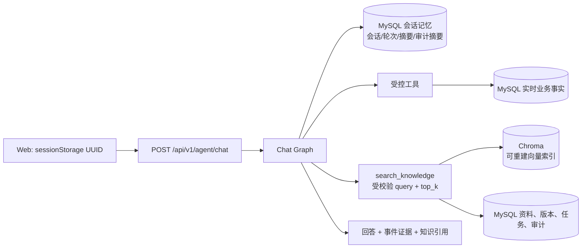
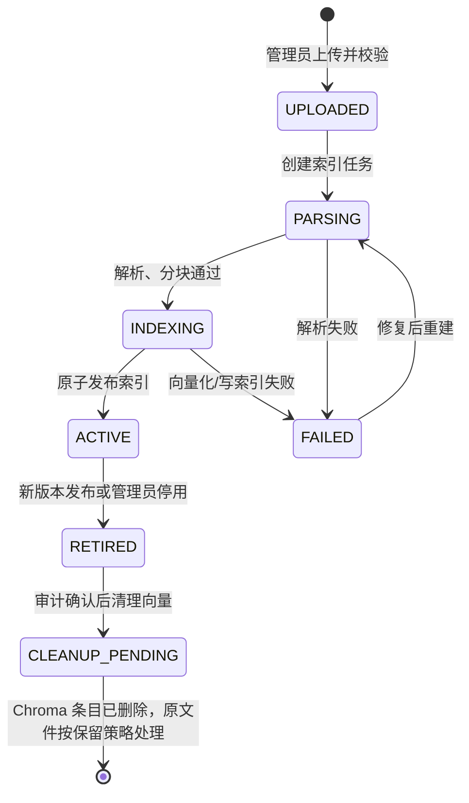

# Agent 会话记忆与 RAG 向量库管理规范

> **状态：首版实施、运维与验收规范（尚未上线）**  
> **版本：v1.0｜更新时间：2026-09-26**  
> 本文是 Agent 会话记忆与资料知识库的唯一实施准绳。它定义目标架构、接口、数据生命周期、故障降级和验收标准；不应把本文中的能力表述为当前已上线能力。

## 1. 现状、范围与不可变边界

截至本文更新时间，系统已有 `POST /api/v1/agent/chat`、MySQL 违规/摄像头查询工具和受控 LangGraph 工具链，但**尚未实现**会话记忆、Chroma、资料上传、向量检索或知识库管理接口。后端当前仅将 `conversation_id` 传入图状态，不会读取或写入记忆；Web 当前每次发送使用时间戳新建 ID，无法形成连续会话。

本规范的首版范围是单工地、全局共享的施工安全知识库，以及浏览器会话级短期记忆；不增加账号、项目/租户划分、跨设备同步或长期个人画像。

下列边界必须一直成立：

| 数据/能力 | 唯一事实来源 | 是否可进入 RAG | 规则 |
|---|---|---:|---|
| 违规事件、统计、摄像头状态 | MySQL | 否 | 只能由现有受控工具查询；RAG 结果不能覆盖实时事实。 |
| 制度条款、施工方案、处置预案、解释资料 | 版本化资料 + Chroma | 是 | 回答必须提供可定位的资料版本和片段引用。 |
| 会话上下文 | MySQL 会话记忆表 | 否 | 仅保存必要问答与已验证摘要，默认 24 小时后删除。 |
| 模型思维链、令牌、RTSP/连接串、完整敏感日志 | 不保存 | 否 | 不传模型、不写审计、不出现在 API 响应。 |

`conversation_id` 不是用户身份、管理员身份或授权凭据。首版以浏览器会话隔离，因此清除浏览器会话数据、使用新浏览器或新标签页产生的新会话都不会继承旧上下文。

## 2. 目标架构



MySQL 是所有持久业务状态、资料元数据、版本和任务状态的事实来源；Chroma 只是可从原始文件和 MySQL 元数据重建的本地向量索引。原始上传文件必须位于受控备份目录/对象存储，目录不得接受模型输入或通过聊天工具读取。

Chat Graph 的新增顺序固定如下：

```text
validate_request
  → load_memory_context（失败：空上下文继续）
  → select_tool
  → validate_tool_decision
  → execute MySQL tool / search_knowledge
  → generate_answer
  → persist_memory_and_audit（失败：标记降级，不重试原回答）
  → END
```

记忆在工具选择之前加载，使后续提问可引用近期对象；只在回答成功后写入。记忆或 RAG 失效绝不能阻塞违规、摄像头状态、天气等已有工具，也不能改变其数据来源。

## 3. 会话记忆设计

### 3.1 浏览器会话 ID

前端在首次进入 Agent Copilot 时生成 `crypto.randomUUID()`，存入 `sessionStorage`，之后每次请求复用；键名固定为 `agent_conversation_id`。`sessionStorage` 的作用域是当前浏览器标签页会话，不跨浏览器、设备或账号同步。不得用时间戳、问题文本或用户可见信息派生该 ID。

```ts
const key = 'agent_conversation_id'
const conversationId = sessionStorage.getItem(key) ?? crypto.randomUUID()
sessionStorage.setItem(key, conversationId)
await sendChatMessage({ question, conversation_id: conversationId })
```

服务端接收的 ID 必须限制为 UUID（或在兼容迁移期使用严格的服务器生成 opaque ID），最大 128 字符；空值可作为单轮请求处理，不创建可恢复会话。不要仅因客户端给出相同 ID 就将其解释为“已认证用户”。

### 3.2 最小数据模型

以下表通过 Alembic 迁移创建；所有时间为 UTC。实际 ORM 可使用相同语义的命名，但外键、唯一约束、状态和索引不可省略。

```text
conversation_sessions
  conversation_id       VARCHAR(128) PRIMARY KEY
  created_at_utc        DATETIME(6) NOT NULL
  last_active_at_utc    DATETIME(6) NOT NULL
  expires_at_utc        DATETIME(6) NOT NULL INDEX

conversation_turns
  turn_id               CHAR(36) PRIMARY KEY
  conversation_id       VARCHAR(128) NOT NULL INDEX → conversation_sessions
  sequence_no           INT NOT NULL
  user_text             TEXT NOT NULL                 # 已最小化/脱敏的提问
  assistant_text        TEXT NOT NULL                 # 最终回答，不含 CoT
  verified_facts_json   JSON NOT NULL                  # 受控工具/RAG 的短事实摘要
  created_at_utc        DATETIME(6) NOT NULL
  UNIQUE(conversation_id, sequence_no)

conversation_summaries
  conversation_id       VARCHAR(128) PRIMARY KEY → conversation_sessions
  summary_text          TEXT NOT NULL                  # 滚动摘要
  covered_through_seq   INT NOT NULL
  updated_at_utc        DATETIME(6) NOT NULL

conversation_tool_audits
  audit_id              CHAR(36) PRIMARY KEY
  conversation_id       VARCHAR(128) NOT NULL INDEX → conversation_sessions
  turn_id               CHAR(36) NULL → conversation_turns
  tool_name             VARCHAR(64) NOT NULL
  success               BOOLEAN NOT NULL
  duration_ms           INT NOT NULL
  purpose               VARCHAR(256) NOT NULL
  created_at_utc        DATETIME(6) NOT NULL
```

`verified_facts_json` 仅容纳已校验的事件 ID、时间范围、统计数字、资料/片段 ID 和工具结果摘要。禁止保存原始模型提示、模型逐步推理、API Key、Authorization 头、RTSP URI、数据库 URL、绝对文件路径、完整异常堆栈或完整敏感日志。若业务问题本身包含敏感值，写入前必须进行字段级删除/掩码，而不是依赖提示词要求模型忘记。

### 3.3 读取、压缩与过期

每个聊天请求按以下方式构建上下文：

1. 使用 `conversation_id` 查询 `expires_at_utc > now_utc` 的会话；没有有效会话时按单轮处理或创建新会话。
2. 取滚动摘要，以及最近 `AGENT_MEMORY_RECENT_TURNS` 个轮次的最小问答和已验证事实。
3. 只将这一受限上下文注入工具选择/回答节点；数据库事件仍必须重新通过受控工具读取。
4. 回答成功后保存当前轮次、精简工具审计，并更新摘要；摘要只描述已验证结论和未完成事项。

默认会话 TTL 为 24 小时，由 `AGENT_MEMORY_TTL_HOURS=24` 配置；每次成功写入轮次时将 `expires_at_utc` 刷新为 `now_utc + TTL`（滑动过期）。过期清理任务以小批次先删子表再删会话主表，使用 `expires_at_utc` 索引；任务必须记录删除数量、开始/结束时间和失败原因，但不得记录被删会话正文。删除是物理删除，不做“逻辑过期后长期保留”。建议每小时运行一次，并在每日巡检确认最久的过期记录已被清理。

## 4. 知识库与资料生命周期

### 4.1 支持的资料与安全入口

首版只允许管理员上传 PDF、DOCX、Markdown 和 TXT。上传服务必须对扩展名、MIME、大小、文件签名（适用时）和解析结果做校验，服务端生成资料 ID、版本号和存储名；严禁采用原始文件名作为路径，严禁解压用户控制的路径。原始文件保留在服务端受控资料目录/对象存储，按资料 ID 与版本隔离，且不能由 `search_knowledge` 参数访问。

每份资料至少保存标题、来源说明、SHA-256 校验和、上传时间、生效状态、原始文件定位符（仅服务端）、版本号、解析/索引状态及失败原因摘要。PDF 片段记录页码；DOCX/Markdown/TXT 记录标题层级、章节或行区间，保证引用可回溯。

### 4.2 生命周期与状态机



`ACTIVE` 是唯一可检索状态。资料删除采用“先停用（`RETIRED`）→ 审计记录 → 清理该版本 Chroma 片段”的两阶段流程，不能先删除元数据。新版本成功成为 `ACTIVE` 后，旧版本转为 `RETIRED`；版本冲突返回 `409`，不允许覆盖已有版本。相同 SHA-256 的同一有效文件默认复用已有资料版本并返回该记录，不重复建库；如管理员需要独立资料记录，必须显式提供受审计的业务理由。

### 4.3 MySQL 元数据、任务与 Chroma 元数据

```text
knowledge_documents
  document_id, title, source_label, checksum_sha256 UNIQUE,
  current_version, status, created_at_utc, created_by, retired_at_utc

knowledge_document_versions
  document_version_id, document_id → knowledge_documents, version_no,
  storage_key, checksum_sha256, status, parser_name, page_count,
  indexed_at_utc, retired_at_utc, failure_code, failure_detail_safe,
  created_at_utc, created_by,
  UNIQUE(document_id, version_no), UNIQUE(checksum_sha256)

knowledge_index_jobs
  job_id, document_version_id → knowledge_document_versions, operation,
  status, attempt_count, started_at_utc, finished_at_utc,
  error_code, error_detail_safe, requested_by, created_at_utc

knowledge_audits
  audit_id, actor, action, document_id, document_version_id, job_id,
  detail_safe_json, created_at_utc
```

建议索引：`knowledge_documents(status, created_at_utc)`、`knowledge_document_versions(document_id, version_no)`、`knowledge_document_versions(status, indexed_at_utc)`、`knowledge_index_jobs(status, created_at_utc)` 和 `knowledge_audits(document_id, created_at_utc)`。

每一个 Chroma chunk 的 metadata 至少有 `chunk_id`、`document_id`、`document_version_id`、`version_no`、`title`、`status=ACTIVE`、`page_or_section` 和 `checksum_sha256`。检索前后都以 MySQL 的当前有效版本为准：Chroma 返回陈旧条目、版本不匹配或不是 `ACTIVE` 时必须丢弃。metadata 仅保存检索和引用所需字段，不得保存密钥、网络地址、原始文件路径或业务实时数据。

### 4.4 分块、嵌入与检索

解析器应尽量按标题/段落/页边界分块，再应用长度与重叠限制；每块保留其可定位的页码或章节。先将全部片段写入版本隔离的 staging collection/命名空间，在向量化和校验全部成功后再原子标为可用，避免半份资料被检索。

`search_knowledge` 仅服务于“制度条款、施工方案、处置预案、为什么/如何解释”等非实时问题。它接收的唯一模型可控参数为通过 Pydantic 校验的 `query` 和 `top_k`，服务器强制 `1 <= top_k <= AGENT_RAG_TOP_K_MAX`。模型不得传入文件路径、URL、collection 名、where/filter 表达式、SQL、Chroma 命令或嵌入向量。工具内部固定 collection、固定 metadata 条件和已启用版本集合。

若问题同时问“当前有几起违规”与“如何处置”，图应分别调用 MySQL 实时工具与 `search_knowledge`，在回答中清楚标注实时事实和制度引用；不能用检索文档代替当前事件查询。

## 5. 聊天和管理 API 契约

### 5.1 保持的聊天接口

聊天入口保持 `POST /api/v1/agent/chat`。`conversation_id` 现在是稳定会话标识；响应新增 `knowledge_citations`，与已有事件 `evidence` 分开：

```json
{
  "request_id": "a4ae38c1-8d3c-4c45-a9e2-1e4b7cb149fd",
  "answer": "……应先划定警戒范围并按预案处置。",
  "evidence": [
    {"event_uuid": "…", "occurred_at_utc": "2026-09-26T03:20:00Z", "snapshot_uri": "snapshots/…jpg"}
  ],
  "knowledge_citations": [
    {
      "document_id": "doc_01J…",
      "version_no": 2,
      "title": "吊装作业安全处置预案",
      "page_or_section": "第 4.2 节 / 第 12 页",
      "chunk_id": "chunk_01J…",
      "relevance_score": 0.87
    }
  ],
  "tool_trace": [{"tool_name": "search_knowledge", "success": true, "purpose": "检索吊装处置预案", "duration_ms": 42}],
  "degraded": false,
  "error_code": null
}
```

只有实际使用并通过有效版本校验的片段才可返回引用。分数仅用于排序/诊断，不可被表达为法律或安全结论的置信度。前端应单独渲染“知识资料引用”，不得把它混入违规证据卡片。

### 5.2 管理接口

所有下列接口均使用已有 `Authorization: Bearer <AGENT_ADMIN_TOKEN>` 管理员鉴权，且每次写操作写入 `knowledge_audits`。二进制资料通过 `multipart/form-data` 上传；其余请求为 JSON。

| 方法 | 路径 | 作用 | 关键语义 |
|---|---|---|---|
| `POST` | `/api/v1/knowledge/documents` | 上传资料 | 返回 `201` 与资料/版本/任务；重复 checksum 返回现有记录或 `409`（由 `dedupe_mode` 明确）。 |
| `GET` | `/api/v1/knowledge/documents?limit=&offset=&status=` | 分页资料列表 | 不返回原始文件路径。 |
| `GET` | `/api/v1/knowledge/documents/{document_id}` | 资料及版本详情 | 返回安全的状态、版本、任务摘要与引用定位。 |
| `POST` | `/api/v1/knowledge/documents/{document_id}/versions` | 创建新版本 | `multipart/form-data`；可要求 `expected_current_version` 防止冲突。 |
| `POST` | `/api/v1/knowledge/documents/{document_id}:activate` | 启用指定版本 | 必须已完成索引；可使旧有效版退役。 |
| `POST` | `/api/v1/knowledge/documents/{document_id}:retire` | 停用资料 | 从检索集立即移除，再异步清理向量。 |
| `POST` | `/api/v1/knowledge/versions/{version_id}:reindex` | 发起重建 | 创建幂等索引任务，不允许并发重复运行。 |
| `GET` | `/api/v1/knowledge/index-jobs?status=&limit=&offset=` | 查询索引任务 | 返回进度、失败安全摘要和时间。 |
| `GET` | `/api/v1/knowledge/index-jobs/{job_id}` | 查询单任务 | 用于轮询，不泄露堆栈/路径。 |

所有状态变更使用清晰的 `409`（版本冲突、运行中任务）、`422`（格式/参数/状态机非法）、`413`（超限）、`401/403`（鉴权）和 `503`（依赖不可用）语义。上传、版本发布和索引任务的响应不暴露原始存储路径、Chroma collection 名或异常堆栈。

## 6. 配置、依赖与部署

下列变量由 `Settings.from_env()` 读取并在启动时校验。目录应为服务账号专用、非 Web 静态根目录、可备份且不可由聊天请求修改；生产环境通过部署机密注入配置。

| 变量 | 默认值 | 含义/约束 |
|---|---|---|
| `AGENT_MEMORY_ENABLED` | `true` | 是否启用持久会话记忆；`false` 时严格单轮。 |
| `AGENT_MEMORY_TTL_HOURS` | `24` | 正整数，会话绝对/滑动过期策略必须在代码中明确。 |
| `AGENT_MEMORY_RECENT_TURNS` | `6` | 加载的最近轮次数，限制为安全上限。 |
| `AGENT_MEMORY_CLEANUP_INTERVAL_MINUTES` | `60` | 清理调度间隔。 |
| `AGENT_RAG_ENABLED` | `false` | 显式开启 RAG；关闭时不得实例化 Chroma。 |
| `AGENT_RAG_PERSIST_DIRECTORY` | `./runs/chroma` | 本地持久化目录，不能暴露为下载目录。 |
| `AGENT_RAG_DOCUMENT_DIRECTORY` | `./runs/knowledge` | 原始资料受控存储目录。 |
| `AGENT_RAG_EMBEDDING_MODEL` | 中文语义嵌入模型 | 例如部署认可的中文语义模型；变更模型需全量重建。 |
| `AGENT_RAG_CHUNK_SIZE` | `800` | 每块最大字符/token 单位须在实现中固定并记录。 |
| `AGENT_RAG_CHUNK_OVERLAP` | `120` | 小于 `CHUNK_SIZE`。 |
| `AGENT_RAG_TOP_K` | `4` | 默认返回条数。 |
| `AGENT_RAG_TOP_K_MAX` | `8` | 工具可请求上限。 |
| `AGENT_RAG_MAX_UPLOAD_BYTES` | `20971520` | 单文件最大 20 MiB。 |
| `AGENT_RAG_ALLOWED_EXTENSIONS` | `.pdf,.docx,.md,.txt` | 格式白名单；不得仅信任扩展名。 |
| `AGENT_ADMIN_TOKEN` | 无 | 管理接口必须配置；不得记录或回显。 |

实施时应为 PDF/DOCX 解析器、Chroma 和选定嵌入提供方增加锁定版本依赖，并在 CI 覆盖无可选依赖、无模型凭据及目录不可写等启动场景。嵌入 API 凭据如存在，使用独立环境变量；禁止写到 MySQL、Chroma metadata、上传文件名、聊天上下文或日志。

## 7. 故障、降级与恢复

| 情况 | 对聊天的行为 | 管理/恢复动作 |
|---|---|---|
| 会话记忆读取/写入失败 | 跳过记忆，继续单轮及 MySQL 工具；`degraded=true`，写安全错误码。 | 检查 DB、迁移和清理任务；不补写未知轮次。 |
| Chroma 缺失、不可打开或嵌入服务不可用 | `search_knowledge` 失败且不返回伪引用；其他实时工具继续工作。 | 置任务失败/告警，修复依赖后由原始文件和 MySQL 元数据重建。 |
| 资料解析失败 | 不发布任何片段，版本为 `FAILED`。 | 返回安全失败摘要，修复文件/解析器后重建。 |
| 索引中断 | staging 片段不可检索，旧 `ACTIVE` 版本继续提供服务。 | 清除该任务 staging 并重试；禁止半完成版本激活。 |
| 会话已过期 | 作为无上下文新会话；不尝试恢复已物理删除数据。 | 正常行为，可在 UI 提示“会话已过期”。 |
| 重复文件 | 不重复向量化。 | 返回已有 checksum 对应的资料/版本，管理员决定是否建立新版本。 |
| 版本冲突 | 不覆盖、不自动重试。 | 客户端刷新详情后以最新版本重新提交。 |
| 检索无结果 | 正常回答“未在当前有效资料中找到依据”，不臆造条款。 | 管理员补充资料或优化受控查询。 |

降级响应必须说明受影响的是“会话上下文”或“资料检索”，不能笼统宣称实时事件数据不可信。任何 RAG 错误不得转化为访问本地文件、密钥、实时业务表或原始异常详情的能力。

## 8. 日常运维与重建步骤

每日检查：上传/索引失败任务、`ACTIVE` 资料版本是否可检索、Chroma 磁盘空间、MySQL 资料/任务审计、过期会话清理量和聊天/RAG 降级率。变更嵌入模型、分块策略或解析器后，必须记录变更原因、版本和影响资料，并执行可追踪的全量重建。

建议的全量重建流程：

1. 备份 MySQL 的资料元数据、审计和受控原始资料；确认备份可读。
2. 暂停新的发布任务，保留当前 `ACTIVE` collection 为只读回退版本。
3. 为每个仍有效的资料版本创建重建任务，在新的 staging collection 解析、分块、向量化并校验 chunk 数和 metadata。
4. 用抽样查询核对引用的资料 ID、版本、页码/章节；确认没有 `RETIRED`/停用版本结果。
5. 原子切换到新 collection，记录切换审计；持续监控检索错误和延迟。
6. 回退期结束且确认可恢复后，才清理旧 collection。MySQL 和原始资料永远是重建依据。

备份、恢复和清理操作均应以最小权限服务账号执行。不得通过 shell 路径或管理 API 从聊天输入推导删除对象；资料删除必须沿用第 4.2 节的审计状态机。

## 9. 实施顺序与验收矩阵

推荐按“先隔离和可降级，后上传和索引”的顺序实施：

1. 增加 Settings、数据库迁移、`ConversationMemoryPort` 和 no-op 实现；接入稳定浏览器会话 ID。
2. 在 Graph 中加入加载/写入记忆及故障分支，完成过期清理任务和测试。
3. 增加资料元数据、管理员鉴权接口、受控文件存储与解析/索引任务。
4. 实现 `KnowledgeRetrieverPort`、本地持久 Chroma、`search_knowledge` 的严格 DTO/白名单和引用响应。
5. 接入前端知识引用展示、管理员资料管理页（如本迭代包含 Web），完成故障演练、备份与验收。

| 验收项 | 通过条件 |
|---|---|
| 稳定会话 ID | 页面刷新后复用同一 `conversation_id`；不同浏览器会话读取不到彼此上下文。 |
| 记忆最小化与过期 | 仅保存允许字段；超过 24 小时后会话、轮次、摘要和审计子表被物理删除。 |
| 记忆降级 | 让记忆端口失败，聊天仍能完成 MySQL 事件查询，且不错误使用旧上下文。 |
| 四种资料格式 | PDF、DOCX、MD、TXT 可完成校验、解析、分块、索引、版本和停用流程。 |
| 去重与冲突 | 相同 checksum 不重复建库；并发版本更新返回 `409` 并保留原有效版本。 |
| 引用可追溯 | 每个 RAG 回答返回资料 ID、版本、标题、页码/章节、chunk ID 和相关度。 |
| 资料有效性 | `RETIRED`、停用和半完成版本永远不会被检索。 |
| RAG 隔离 | 模型无法经工具传入路径、URL、过滤器、向量命令或读取本地文件/密钥/实时表。 |
| RAG 故障 | 关闭 Chroma 或嵌入服务后，违规、摄像头状态和天气工具仍可用；无伪造引用。 |
| 可重建性 | 从 MySQL 元数据和原始资料重建新 Chroma 后，抽样引用定位正确且审计完整。 |

满足全部验收项前，界面、发布说明和进展报告只能称这些能力为“规划中/实施中”，不得称为已上线的会话记忆或 RAG。
