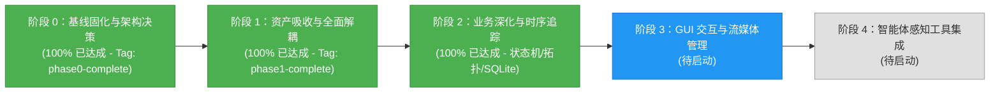

# 智能建造安全感知系统 (Perception) 当前进展报告

> **报告版本**：v3.0 (Phase 2 Complete)  
> **更新时间**：2026-09-25  
> **当前里程碑**：  
> - **阶段 0：基线固化与架构决策 (Phase 0) —— 已 100% 完成 (Git Tag: `phase0-complete`)**  
> - **阶段 1：资产吸收与全面解耦 (Phase 1) —— 已 100% 完成 (Git Tag: `phase1-complete`)**  
> - **阶段 2：业务深化与时序追踪 (Phase 2) —— 已 100% 完成**  
> **历史工程解耦**：`Smart_Construction/` 目录已彻底下线，所有业务状态机、拓扑匹配与存储归档均实现 100% 独立自包含！

---

## 1. 里程碑概览与当前阶段状态

本项目的目标是将 Fork 的 `Smart_Construction` 消化、吸收并重构为母工程 `civil_engineering_agent` 的高可靠、模块化感知子系统（`perception/`）。

目前已顺利达成**阶段 0、阶段 1、阶段 2 全部交付目标**：
- **阶段 0**：建立运行时环境矩阵、Pydantic 契约、纯 Python 追踪引擎、高精度脚底触地几何算法，通过自动化单测与 CPU 冒烟。
- **阶段 1**：Qt GUI 与图标资产迁移、数据工程脚本迁移、实现官方模块 `UltralyticsDetector`、双模型回归验证，并彻底物理删除旧工程目录。
- **阶段 2**：
  1. **单调时钟防抖状态机与滞留超时告警**：消除电子围栏边缘抖动，支持连续进入防抖（3帧）、离开冷却（5帧）与滞留超时告警（$T_{\text{alarm}} \ge 5.0\text{s}$）；
  2. **“人-头-帽”空间拓扑匹配**：通过人体解剖学上部区域与匈牙利全局二分匹配算法，实现人体佩戴安全帽的严密逻辑判定；
  3. **SQLite 违规事件持久化与快照截图存储**：事件自动入库（带索引与结构化字段），自动在图片上渲染危险区遮罩、违规人员框、时间戳及警告横幅；
  4. **端到端一体化安全感知流水线 (`SafetyPerceptionPipeline`)**：将检测、拓扑绑定、追踪、状态机防抖与存储存档完全打通，并在桌面端 GUI 与端到端视频上验证通过。



---

## 2. 阶段 2 核心成果详述 (Phase 2 Deliverables)

### 2.1 “人-头-帽”空间拓扑匹配算法 (`perception/geometry/topology.py`)
- **解剖学头部有效感应区域**：
  为检测到的每个人体框 $P$ 动态计算头部感应包围盒：
  $$R_{\text{head}} = [x_1 - 0.15 w, \; y_1 - 0.20 h, \; x_2 + 0.15 w, \; y_1 + 0.35 h]$$
- **全局最优二分匹配（匈牙利算法）**：
  基于候选安全帽/裸露头部与 $R_{\text{head}}$ 的交集比例（$IoA \ge 0.4$）和水平中心偏移建立代价矩阵，使用 `scipy.optimize.linear_sum_assignment` 进行全局独占匹配，彻底避免多工人重叠时安全帽归属漂移与误判。
- **佩戴状态细分**：
  - `HELMETED`：有效匹配到安全帽；
  - `UNHELMETED`：匹配到裸露头部且无安全帽（违规）；
  - `UNKNOWN`：远距离或严重遮挡未探测到头顶信息。

### 2.2 单调时钟防抖状态机与滞留超时监控 (`perception/tracking/state_machine.py`)
- **多状态流转引擎 (`ZoneIntrusionState`)**：
  - `OUTSIDE` $\to$ `PENDING_ENTER` $\to$ `INTRUSION`（连续进入 3 帧确认，触发 WARNING 级告警）；
  - `INTRUSION` 维持并累计滞留时长 $t_{\text{dwell}}$，当 $t_{\text{dwell}} \ge T_{\text{alarm}}$（默认 5.0 秒）自动跃迁至 `DWELL_TIMEOUT` 并升级为 CRITICAL 级致命告警；
  - `DWELL_TIMEOUT`/`INTRUSION` $\to$ `PENDING_EXIT` $\to$ `OUTSIDE`（离开区域需连续 5 帧冷却确认，杜绝脚底触地关键点在边缘高频抖动造成的告警振荡）；
- **安全帽脱摘时序防抖 (`HelmetComplianceTracker`)**：
  连续 5 帧未戴帽才触发 `NO_HELMET` 违规，连续 3 帧戴帽自动解除，消除单帧漏检带来的“报警闪烁”；
- **双时钟源支持**：
  实时流模式使用 `time.monotonic()`；离线视频评测模式使用视频时间戳（`frame_id / fps`），确保测试与回归 100% 确定可复现。

### 2.3 SQLite 违规事件持久化与快照截图存储 (`perception/storage/event_store.py`)
- **结构化数据库存储 (`violation_events` 表)**：
  包含 `event_uuid`、`track_id`、`camera_id`、`violation_type`、`severity`、`zone_name`、`start_time`、`end_time`、`duration_seconds`、`snapshot_path`、`extra_details`、`created_at`，并在重要字段上建立 B-Tree 索引；
- **智能快照归档引擎**：
  违规触发时自动生成取证图片，按日期目录归档（`snapshots/YYYYMMDD/{uuid}.jpg`），画面中叠加：
  1. 危险区半透明红色警告多边形；
  2. 违规工人专属红色外接框与跟踪编号；
  3. 顶部高对比度警报横条（包含级别、违规类型、摄像头编号与区域名）；
- **聚合统计与查询 API**：
  内置 `query_events`、`get_statistics`，支持开箱即用获取各类型违规频次、平均滞留时间与告警级别分布。

### 2.4 端到端一体化安全感知流水线 (`perception/tracking/safety_pipeline.py`)
- 高度封装的 `SafetyPerceptionPipeline`：
  $$\text{Frame} \longrightarrow \text{BaseDetector} \longrightarrow \text{Topology Matching} \longrightarrow \text{BYTETracker} \longrightarrow \text{SafetyMonitor} \longrightarrow \text{EventStore}$$
- 将 GUI 桌面端主线程（`perception/gui/app.py`）的工作流全面无缝升级至此流水线，实现了桌面播放与离线处理时实时的电子围栏渲染、脚底着地点高亮、头盔状态显示与违规事件自动落盘。

---

## 3. 测试与验证通过情况

### 3.1 自动化测试套件（24 项全部通过，通过率 100%）
运行命令：`python3 -m pytest tests/ -v`，用时 5.84 秒：
```text
tests/test_data_tools.py::test_voc_bbox_to_yolo_xywh PASSED              [  4%]
tests/test_data_tools.py::test_voc_xml_conversion_and_merge PASSED       [  8%]
tests/test_detector_interface.py::test_mock_detector_interface PASSED    [ 12%]
tests/test_event_store.py::test_event_store_save_and_query PASSED        [ 16%]
tests/test_event_store.py::test_event_store_snapshot_archiving PASSED    [ 20%]
tests/test_geometry.py::test_point_in_polygon PASSED                     [ 25%]
tests/test_geometry.py::test_person_in_danger_zone_feet_detection PASSED [ 29%]
tests/test_geometry.py::test_gui_coordinate_mapping_roundtrip PASSED     [ 33%]
tests/test_geometry.py::test_load_danger_zones_from_json PASSED          [ 37%]
tests/test_regression.py::test_legacy_yolo_adapter_regression PASSED     [ 41%]
tests/test_regression.py::test_ultralytics_detector_regression PASSED    [ 45%]
tests/test_safety_pipeline.py::test_safety_pipeline_end_to_end_on_sample_video PASSED [ 50%]
tests/test_schemas.py::test_bounding_box_properties PASSED               [ 54%]
tests/test_schemas.py::test_detection_result_serialization PASSED        [ 58%]
tests/test_schemas.py::test_violation_event_creation PASSED              [ 62%]
tests/test_state_machine.py::test_zone_tracker_debounce_and_dwell_timeout PASSED [ 66%]
tests/test_state_machine.py::test_helmet_compliance_tracker_debounce PASSED [ 70%]
tests/test_state_machine.py::test_worker_safety_monitor_multi_zone PASSED [ 75%]
tests/test_topology.py::test_topology_single_person_with_helmet PASSED   [ 79%]
tests/test_topology.py::test_topology_single_person_with_bare_head PASSED [ 83%]
tests/test_topology.py::test_topology_multiple_persons_and_helmets_bipartite PASSED [ 87%]
tests/test_topology.py::test_topology_no_head_or_helmet_detected PASSED  [ 91%]
tests/test_tracker.py::test_byte_tracker_association PASSED              [ 95%]
tests/test_video_pipeline.py::test_sample_walk_video_ground_truth_consistency PASSED [100%]
======================== 24 passed, 9 warnings in 5.84s ========================
```

---

## 4. 当前代码库拓扑结构

```text
civil_engineering_agent/
├── perception/                         # 【自包含感知子系统】
│   ├── configs/                        # 集中式配置 (default_danger_zones.json)
│   ├── data_tools/                     # 数据格式转换与伪标签合并 (voc_to_yolo, label_merger)
│   ├── detectors/                      # 统一检测器实现 (BaseDetector, Legacy, Ultralytics)
│   │   ├── base.py
│   │   ├── legacy_yolo_adapter.py
│   │   ├── ultralytics_detector.py
│   │   └── yolov5_legacy/              # 自包含遗留 YOLOv5 模型架构
│   ├── geometry/                       # 高精度脚底触地空间计算与空间拓扑匹配
│   │   ├── danger_zone.py
│   │   └── topology.py                 # 人-头-帽解剖学匈牙利二分匹配
│   ├── gui/                            # 现代化 PyQt5 桌面端应用与图标素材
│   │   ├── app.py                      # 集成 SafetyPerceptionPipeline 与可视化
│   │   └── UI/                         # main_window.ui, icon/
│   ├── schemas/                        # Pydantic v2 强类型契约
│   ├── storage/                        # SQLite 违规事件持久化与快照生成
│   │   └── event_store.py
│   ├── tracking/                       # ByteTrack 引擎、防抖状态机与安全流水线
│   │   ├── byte_tracker.py
│   │   ├── state_machine.py            # 单调时钟防抖状态机与滞留超时监控
│   │   └── safety_pipeline.py          # 端到端一体化安全感知流水线
│   └── weights/                        # 模型权重与 SHA256 验签清单
├── docs/                               # 规范文档中心
│   ├── README.md                       # 文档中心总览
│   └── perception/                     # 感知系统专区 (PROGRESS.md, legacy_meta.json 等)
├── tests/                              # 自动化测试套件 (24 项单元测试、状态机测试与端到端测试)
├── scripts/                            # 冒烟与基线生成脚本
├── requirements*.lock                  # 依赖锁定文件
└── .gitignore                          # 根目录全局过滤规则
```

---

## 5. 后续阶段规划 (Phase 3 & Beyond)

- **阶段 3（GUI 交互与流媒体管理）**：
  - GUI 播放器支持鼠标直接在画面上拖拽、点击交互式绘制/编辑电子围栏多边形，双击闭合并实时持久化为 JSON 配置；
  - 多路 RTSP/ONVIF 视频流配置管理器，具备指数退避自动断线重连守护线程。
- **阶段 4（母工程 Agent 工具化集成）**：
  - 封装 `CivilSafetyPerceptionService` 标准工具接口；
  - 支撑 LLM 智能体自主调用执行工地巡检、安全统计与安全日报自动生成。
