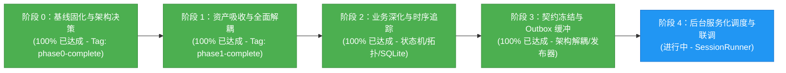

# 智能建造安全感知系统 (Perception) 当前进展报告

> **报告版本**：v4.1 (Camera Status Aligned & Blocker 1 Cleared)  
> **更新时间**：2026-09-25  
> **当前里程碑**：  
> - **阶段 0：基线固化与架构决策 (Phase 0) —— 100% 完成 (Git Tag: `phase0-complete`)**  
> - **阶段 1：资产吸收与全面解耦 (Phase 1) —— 100% 完成 (Git Tag: `phase1-complete`)**  
> - **阶段 2：业务深化与时序追踪 (Phase 2) —— 100% 完成**  
> - **阶段 3 / 联调准备：跨系统契约冻结、Outbox 离线缓冲与硬编码专项治理 —— 100% 完成**  
> **测试状态**：感知模块 **37 项**自动化单元与集成测试全部通过（全项目 **44 项**通过率 100%）！

---

## 1. 里程碑概览与当前阶段状态

本项目的目标是将 Fork 的 `Smart_Construction` 消化、吸收并重构为母工程 `civil_engineering_agent` 的高可靠、模块化感知子系统（`perception/`）。

目前已顺利达成**阶段 0、阶段 1、阶段 2 及跨系统联调契约治理的全部目标**：
- **阶段 0**：建立运行时环境矩阵、Pydantic 契约、纯 Python 追踪引擎、高精度脚底触地几何算法，通过自动化单测与 CPU 冒烟。
- **阶段 1**：Qt GUI 与图标资产迁移、数据工程脚本迁移、实现官方模块 `UltralyticsDetector`、双模型回归验证，并彻底物理删除旧工程目录。
- **阶段 2**：
  1. **单调时钟防抖状态机与滞留超时告警**：消除电子围栏边缘抖动，支持连续进入防抖、离开冷却与滞留超时告警；
  2. **“人-头-帽”空间拓扑匹配**：通过人体解剖学上部区域与匈牙利全局二分匹配算法，实现人体佩戴安全帽的严密逻辑判定；
  3. **SQLite 违规事件持久化与快照截图存储**：事件自动入库，自动在图片上渲染危险区遮罩、违规人员框、时间戳及警告横幅；
  4. **端到端一体化安全感知流水线 (`SafetyPerceptionPipeline`)**：打通检测、拓扑绑定、追踪、状态机防抖与存储存档。
- **最新阶段（契约与治理）**：
  1. **联合集成契约（Contract v1）**：冻结跨系统联调 4 个关键细节（单 `event_uuid` 生命周期不变量、UTC 时间锚点转换、防抖配置化、独立 Outbox 表）；
  2. **Outbox 离线存储与发布器**：实现带指数退避、422 终态错误过滤与幂等性的 `PerceptionEventPublisher`；
  3. **架构与硬编码整治**：解决多相机 ByteTrack ID 串扰、计算设备动态适配、类别标签语义解耦；
  4. **测试体系重构**：将所有感知测试归类至 `tests/perception/`，保持与 `tests/agent/` 统一规范；
  5. **消除状态上报 422 阻塞项**：对齐 Agent 状态模型校验需求，成功打通状态上行。



---

## 2. 本阶段核心交付成果 (Recent Key Deliverables)

### 2.1 跨子系统联调契约实现 (`perception/schemas/contract_v1.py`)
- **事件契约 (`PerceptionEventContractV1`)**：
  严格对齐 `docs/integration/CV_Agent_Web_Integration_Contract.md`，定义标准 `UPSERT` 违规事件载荷，包含 `event_uuid`、`camera_id`、`monitor_session_id`、`track_id`、`violation_type`、`severity`、`status`、`occurred_at_utc`、`snapshot_uri` 等关键字段。
- **高精度时间锚点 (`TimeAnchor`)**：
  以启动监控会话时刻作为双时间轴基准，既保留单调时钟计算时长的抗干扰优势，又精准换算出供 MySQL/Web 审计的 UTC ISO 8601 时间戳：
  $$\text{occurred\_at\_utc} = \text{session\_started\_at\_utc} + (t_{\text{monotonic}} - t_{\text{session\_monotonic}})$$
- **相机状态契约与 Agent 对齐 (`CameraStatusContractV1`)**：
  补齐 Agent 侧 `CameraStatusReportV1` 校验必需的 `monitor_session_id` 与 `processed_frame_id`，并提供 `to_agent_payload()` 方法将 `helmet_compliance_rate` 平滑塞入 `extra_details`，彻底消除 422 验证报错。
- **运行配置契约 (`CameraRunConfigContractV1`)**：
  包含多边形顶点 `polygon`、进入/离开防抖帧数、报警停留阈值等。

### 2.2 独立 SQLite Outbox 存储与事件发布器 (`perception/services/event_publisher.py`)
- **专用 Outbox 数据库表 (`outbox_events`)**：
  设计包含 `event_uuid`、`payload_json`、`retry_count`、`next_retry_at`、`last_error`、`created_at`、`delivered_at`，与业务事件表严格物理隔离。
- **发布策略与重试机制**：
  - 成功投递或 Agent 幂等更新成功（200/201）：立即标记 `delivered_at`；
  - 遇到网络超时或 5xx 服务端错误：采用指数退避算法（$2^{\text{retry\_count}}$，上限 60 秒）计算下一次重试时间；
  - 遇到 400/422 客户端格式错误：识别为不可恢复终态，停止自动重试并记录错误原因；
  - 提供 `flush_outbox()` 机制，在网络恢复后自动批量重试积压事件。

### 2.3 状态机单一 UUID 升级保持与配置化 (`perception/tracking/state_machine.py`)
- **事件升级与结案不换号**：
  一次完整的“进入 $\to$ 滞留超时 $\to$ 离开”生命周期全程使用唯一不变的 `event_uuid`：
  1. **初次进入**：`severity=WARNING`, `status=ACTIVE`；
  2. **滞留超时**：更新同一记录为 `severity=CRITICAL`, `extra_details.escalation_reason="DWELL_TIMEOUT"`；
  3. **离开区域**：更新同一记录为 `status=RESOLVED`, `resolved_at_utc=...`，总时长准确归档。
- **防抖参数全面配置化**：
  支持通过 `update_config()` 动态调整 `enter_debounce_frames`、`exit_debounce_frames`、`helmet_debounce_frames` 与停留阈值。

### 2.4 硬编码与架构弊端治理
1. **消除多相机 ByteTrack ID 冲突**：
   在 [`BYTETracker`](file:///home/jjc/projects/python/civil_engineering_agent/perception/tracking/byte_tracker.py) 引入实例级 `_next_id` 计数器与 `next_track_id()`，取代原先全局静态共享类变量 `STrack.shared_id`，实现多路摄像头实例间的完全隔离；
2. **计算设备动态探查 (`get_optimal_device`)**：
   在 [`perception/detectors/base.py`](file:///home/jjc/projects/python/civil_engineering_agent/perception/detectors/base.py) 提供统一设备仲裁机制（参数显式指定 $\to$ 环境变量 `PERCEPTION_DEVICE` $\to$ CUDA 探查 $\to$ CPU 回落），消除各模型适配器和 GUI 中多处 `device="cpu"` 写死；
3. **拓扑匹配类别解耦**：
   [`perception/geometry/topology.py`](file:///home/jjc/projects/python/civil_engineering_agent/perception/geometry/topology.py) 增加通用别名与自定义匹配，解耦原 `class_id == 0, 1, 2` 硬编码，支持任意模型训练标签集；
4. **管道直通 Outbox 与热更新**：
   [`SafetyPerceptionPipeline`](file:///home/jjc/projects/python/civil_engineering_agent/perception/tracking/safety_pipeline.py) 支持直接绑定 `PerceptionEventPublisher`、`TimeAnchor` 与动态配置更新。

### 2.5 联调阻塞项现状与处置方案 (Blocker Status)

| 阻塞项 | 涉及端 | 现状与处置方案 | 状态 |
| :--- | :--- | :--- | :--- |
| **1. 相机状态载荷缺少字段报 422** | CV $\to$ Agent | **已闭环**：CV 补齐 `monitor_session_id`、`processed_frame_id`，合规率打包至 `extra_details`，单测已对齐 Agent Pydantic 校验。 | ✅ 已解决 |
| **2. `GET .../config` 未在 Agent 实现** | Agent 提供<br/>CV 消费 | **处理中 (Graceful Fallback)**：<br/>• **CV 侧**：已实现 `fetch_camera_config()`，当前采取优雅降级策略，请求返回 404 时自动回退至本地默认配置 `default_danger_zones.json`，**核心事件检测链不受影响**；<br/>• **Agent 侧**：待后续在 `agent/api/internal_perception.py` 补充暴露此 GET 路由后，CV 自动实现配置在线拉取与热更新。 | ⏳ 进行中 |

---

## 3. 测试体系重构与通过情况

与 `tests/agent/` 保持对齐，所有感知模块的单元测试、算法回归测试及端到端视频流测试均已模块化归档于 [`tests/perception/`](file:///home/jjc/projects/python/civil_engineering_agent/tests/perception) 目录下。

### 3.1 测试目录分类

```text
tests/
├── conftest.py                    # 统一 sys.path 根目录注入
├── fixtures/                      # 共享真值视频、图片与标注资产
├── agent/                         # Agent 智能体闭环测试 (7 项)
└── perception/                    # 感知模块专区 (37 项)
    ├── test_data_tools.py         # 数据标注与格式转换
    ├── test_detector_interface.py # BaseDetector 抽象与 Mock 验证
    ├── test_event_store.py        # SQLite 本地事件库与快照生成
    ├── test_geometry.py           # 空间多边形判定与双向坐标映射
    ├── test_integration_contract.py # 契约 Schema、TimeAnchor、Outbox 投递与状态上报对齐
    ├── test_regression.py         # YOLO 适配器回归推理验证
    ├── test_safety_pipeline.py    # 完整感知流水线与 Outbox 集成
    ├── test_schemas.py            # 数据契约 Schema 属性与序列化
    ├── test_state_machine.py      # 防抖状态机、滞留升级与多区域测试
    ├── test_topology.py           # 人头帽解剖拓扑与自定义类别匹配
    ├── test_tracker.py            # ByteTrack 跨帧关联与多实例隔离
    └── test_video_pipeline.py     # 真实视频真值一致性
```

### 3.2 测试执行结果（100% 通过）

- **感知测试子集**：`python3 -m pytest tests/perception/ -v` $\to$ **37 passed**
- **全项目自动化测试**：`python3 -m pytest tests/ -v` $\to$ **44 passed, 0 failed**

---

## 4. 下一步开发计划 (Next Steps)

1. **后台无头监控会话调度器 (`CivilSafetyPerceptionService` / `session_runner.py`)**：
   - 摆脱 PyQt5 桌面依赖，支持以纯 Python / CLI / 后台线程启动与停止相机会话；
   - 自动化管理 `monitor_session_id` 生命周期；
2. **周期性心跳与相机状态上报器**：
   - 建立定时任务，滑动统计并在会话期间定期向 Agent 接口 `PUT /internal/v1/perception/cameras/{camera_id}/status` 上报 FPS、在场工人数和合规率；
3. **相机配置动态拉取与热重载**：
   - 配合 Agent 上线 `GET .../config`，完成线上围栏下发与动态热更新对接；
4. **CV 与 Agent 端到端全链路联调**：
   - 以 `sample_walk.mp4` 作为联合联调门禁，打通“视频推理 $\to$ Outbox $\to$ Agent FastAPI $\to$ 数据库 $\to$ LLM 对话查询”整条业务闭环。
