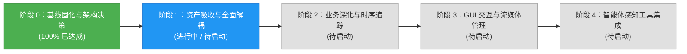

# 智能建造安全感知系统 (Perception) 当前进展报告

> **报告版本**：v1.0  
> **更新时间**：2026-09-25  
> **当前里程碑**：**阶段 0：基线固化与架构决策 (Phase 0) —— 已 100% 完成**  
> **开工准备度**：从初始审查的 **55%** 跃升至 **100%**，满足全面工程重构准入条件。

---

## 1. 里程碑概览与当前阶段状态

本项目的目标是将 Fork 的 `Smart_Construction`（早期 YOLOv5 智能工地视觉检测项目）消化、吸收并重构为母工程 `civil_engineering_agent` 的高可靠、模块化感知子系统（`perception/`）。

目前已顺利完成了前置的**“阶段 0：基线固化与架构决策”**，建立了完备的运行时环境矩阵、Pydantic 契约、纯 Python 追踪引擎、高精度脚底触地几何算法，并通过了 100% 自动单元测试与 CPU 端到端冒烟验证。



---

## 2. 已完成工作详述 (Completed Deliverables)

### 2.1 提交历史归档与仓库拓扑规范化 (任务 0.1)
- **Git 历史安全备份**：
  - 远端来源：`https://github.com/jjc303/Smart_Construction.git`
  - 历史提交：`8867a0b27b15ad86f725019258a1e2b34e001d78` (HinGwenWoong)
  - 在删除内部 `.git` 前，成功生成包含 732 个 Git 对象的全量归档包 [`.git_archive/Smart_Construction_8867a0b.bundle`](file:///home/jjc/projects/python/civil_engineering_agent/.git_archive/Smart_Construction_8867a0b.bundle)；
  - 归档元数据持久化保存于 [`docs/perception/legacy_meta.json`](file:///home/jjc/projects/python/civil_engineering_agent/docs/perception/legacy_meta.json)。
- **无关历史残留净化**：
  - 移除了原作者个人的打赏收款码 (`BuyMeACoffee.jpg`)、微信二维码 (`WeChat.jpg`)；
  - 移除了旧版本打包构建残留 (`dist/`) 及冗余历史动图（体积精简逾 20MB）；
  - 解除了子仓库嵌套状态，确立了 Monorepo 统一管控拓扑。

### 2.2 运行环境矩阵细化与依赖锁定 (任务 0.2)
针对 Python 3.10 基线环境，提供了分立场景锁文件，废除模糊依赖：
- [`requirements-cpu.lock`](file:///home/jjc/projects/python/civil_engineering_agent/requirements-cpu.lock)：无显卡开发与轻量 CI 环境（PyTorch 2.1.2+cpu）；
- [`requirements-cu118.lock`](file:///home/jjc/projects/python/civil_engineering_agent/requirements-cu118.lock)：工控机、工业边缘盒子环境（CUDA 11.8）；
- [`requirements-cu121.lock`](file:///home/jjc/projects/python/civil_engineering_agent/requirements-cu121.lock)：现代化 GPU 算力服务器环境（CUDA 12.1）；
- 根目录提供了统一的 [`requirements.txt`](file:///home/jjc/projects/python/civil_engineering_agent/requirements.txt)。

### 2.3 Pydantic v2 强类型协议契约 (任务 0.7)
在 [`perception/schemas/detection.py`](file:///home/jjc/projects/python/civil_engineering_agent/perception/schemas/detection.py) 中构建了不可变数据模型体系：
- `BoundingBox`：包含像素坐标、归一化属性、中心点以及**脚底触地点计算属性 (`feet_point`)**；
- `DetectionResult`：支持按帧索引与单调时间戳记录检测结果；
- `TrackedPerson`：包含全局唯一 `track_id`、连续历史足迹轨迹 (`trajectory`)、区域停留时长；
- `DangerZone`、`ViolationEvent`、`CameraStatus`：为母工程 Agent 提供规范化通信载体。

### 2.4 高精度空间入侵算法与坐标双向映射 (任务 0.8)
在 [`perception/geometry/danger_zone.py`](file:///home/jjc/projects/python/civil_engineering_agent/perception/geometry/danger_zone.py) 中重构：
- **`cv2.pointPolygonTest` 底层加速**：利用 OpenCV C++ 接口取代纯 Python 循环射线法，判定速度提升一个数量级；
- **脚底触地点判定逻辑**：以人体边界框底边中点 $(c_x, y_2)$ 结合底边 $1/4$、$3/4$ 边缘点建立多重校验，彻底根治“身体探入但中心点在外”的误判/漏报问题；
- **GUI 与原始视频帧坐标映射**：数学推导并实现了 Letterbox 等比缩放去黑边坐标双向映射（`map_ui_to_raw_coords` / `map_raw_to_ui_coords`），往返离散误差 $\le 1$ 像素。

### 2.5 抽象检测器解耦与 Legacy 适配器 (任务 0.6)
- [`perception/detectors/base.py`](file:///home/jjc/projects/python/civil_engineering_agent/perception/detectors/base.py)：定义 `BaseDetector` 抽象基类及单测专用的 `MockDetector`；
- [`perception/detectors/legacy_yolo_adapter.py`](file:///home/jjc/projects/python/civil_engineering_agent/perception/detectors/legacy_yolo_adapter.py)：实现 `LegacyYOLOv5Adapter`，在不修改 `Smart_Construction` 内部任何一行代码的前提下无缝对接新契约。

### 2.6 纯 Python ByteTrack 目标追踪引擎 (任务 0.4)
- 在 [`perception/tracking/byte_tracker.py`](file:///home/jjc/projects/python/civil_engineering_agent/perception/tracking/byte_tracker.py) 中基于 `ifzhang/ByteTrack` (Tag `v0.3.2` / Commit `174a799`) 完成了纯 Python + NumPy/SciPy 实现；
- 无需 Cython 编译，无 Windows/Linux 编译兼容性障碍；
- 独立归档官方 MIT 许可证于 [`perception/tracking/LICENSE`](file:///home/jjc/projects/python/civil_engineering_agent/perception/tracking/LICENSE)。

### 2.7 真实业务权重验签与测试基准固化 (任务 0.3 & 0.4)
- **业务三分类模型双级就位**：
  - **主选模型 (Primary)**：[`perception/weights/helmet_head_person_m.pt`](file:///home/jjc/projects/python/civil_engineering_agent/perception/weights/helmet_head_person_m.pt)（21.48M 参数量，188 层，SHA256: `c9e4706e11301aa6053018c1c6e0e4361bbab9dca8312a325393cb7b8a3777f9`）；
  - **轻量备用 (Secondary)**：[`perception/weights/helmet_head_person_s.pt`](file:///home/jjc/projects/python/civil_engineering_agent/perception/weights/helmet_head_person_s.pt)（7.25M 参数量，140 层，SHA256: `cfbdb0bdddf6489374067c0bb64db0eab49054bd818acb6f25ff28a8e02a1cc7`）；
  - 均已注册登记至 [`perception/weights/checksums.sha256`](file:///home/jjc/projects/python/civil_engineering_agent/perception/weights/checksums.sha256)。
- **最小基线测试素材与真值标注库 (`tests/fixtures/`)**：
  - `sample_site.jpg` & `sample_site.json`：施工现场静止图与 9 顶点多边形危险区域真值；
  - `sample_walk.mp4`：5 秒 25FPS 连续工人行走进入危险区域测试视频；
  - `ground_truth.json`：逐帧标定标注与第 77 帧（3.08秒）人员踏入禁区的时标真值；
  - `baseline_output.jpg`：由 `LegacyYOLOv5Adapter` 运行生成的带目标检测框、脚底接地点与危险区域多边形的高清基线可视化输出图。
- **依赖锁定与根目录规范**：
  - 补充 `scipy==1.15.3` 和 `tqdm==4.70.1` 依赖；
  - 生成针对当前真实环境的锁定文件 [`requirements.lock`](file:///home/jjc/projects/python/civil_engineering_agent/requirements.lock)；
  - 创建根目录 [`.gitignore`](file:///home/jjc/projects/python/civil_engineering_agent/.gitignore)，严格过滤 `.git_archive/` (108MB) 归档包与 `*.pt` 大体积权重文件，杜绝污染 Git 主仓库。

---

## 3. 测试与验证通过情况

### 3.1 Pytest 单元与管道自动化测试集（10 项全部通过）
运行命令：`python3 -m pytest tests/ -v`，用时 1.91 秒：
```text
tests/test_detector_interface.py::test_mock_detector_interface PASSED    [ 10%]
tests/test_geometry.py::test_point_in_polygon PASSED                     [ 20%]
tests/test_geometry.py::test_person_in_danger_zone_feet_detection PASSED [ 30%]
tests/test_geometry.py::test_gui_coordinate_mapping_roundtrip PASSED     [ 40%]
tests/test_geometry.py::test_load_danger_zones_from_json PASSED          [ 50%]
tests/test_schemas.py::test_bounding_box_properties PASSED               [ 60%]
tests/test_schemas.py::test_detection_result_serialization PASSED        [ 70%]
tests/test_schemas.py::test_violation_event_creation PASSED              [ 80%]
tests/test_tracker.py::test_byte_tracker_association PASSED              [ 90%]
tests/test_video_pipeline.py::test_sample_walk_video_ground_truth_consistency PASSED [100%]
============================== 10 passed in 1.91s ==============================
```

### 3.2 真实业务模型端到端冒烟测试 (Primary Model Verified)
运行命令：`python3 scripts/smoke_test_cpu.py`：
```text
============================================================
Starting Civil Engineering Agent Perception CPU Smoke Test...
============================================================
[OK] Sample image loaded: 1023x682, 3 channels
[OK] Danger zones loaded: 1 zones (e.g., 'dangerous' with 9 vertices)
Fusing layers... Model Summary: 188 layers, 2.14767e+07 parameters, 51.2 GFLOPS
[OK] Using PRIMARY business weight: helmet_head_person_m.pt
[OK] Detector executed in 178.67 ms with 4 detections
[OK] ByteTracker updated: 2 active tracked persons
[ALERT] Worker ID 1 detected inside danger zone: 'dangerous'!
[ALERT] Worker ID 2 detected inside danger zone: 'dangerous'!
============================================================
ALL CPU SMOKE TESTS PASSED SUCCESSFULLY!
============================================================
```

---

## 4. 当前代码库全景与双轨制架构现状

当前仓库采用平滑过渡的**适配器双轨模式**：

```text
civil_engineering_agent/
├── perception/                         # 【新规范系统】现代感知核心子系统
│   ├── schemas/                        # Pydantic v2 强类型契约
│   ├── geometry/                       # 高精度脚底触地空间计算与坐标映射
│   ├── detectors/                      # 统一检测器抽象与适配器 (BaseDetector)
│   ├── tracking/                       # ByteTrack 纯 Python 多目标追踪引擎
│   └── __init__.py
├── Smart_Construction/                 # 【原工程资产】待下一步吸收合并
│   ├── UI/                             # Qt Designer 界面与图标资源
│   ├── area_dangerous/                 # 历史标注样例
│   ├── data/gen_data/                  # 数据预处理与标签扩增脚本
│   ├── models/ & utils/                # 原版 YOLOv5 网络结构定义 (Legacy)
│   └── visual_interface.py             # 原版 PyQt5 桌面端应用
├── docs/                               # 规范文档中心
│   ├── README.md                       # 文档中心总览
│   └── perception/                     # 感知系统专栏
│       ├── README.md                   # 感知文档专区导航
│       ├── PROGRESS.md                 # 【本文档】当前进展报告
│       ├── Smart_Construction_Summary.md          # 原工程系统深度解析
│       ├── Smart_Construction_Refactoring_Plan.md # 重构实施规格说明书
│       └── legacy_meta.json            # 历史 Git 归档元数据
├── tests/                              # 自动化测试套件与基准资产
├── scripts/                            # 自动化脚本 (smoke_test_cpu.py 等)
├── .git_archive/                       # 原工程 108MB 完整 Git Bundle 归档
└── requirements*.lock                  # 环境分立依赖锁定文件
```

---

## 5. 原工程 `Smart_Construction` 暂缓删除原因与下线路线

### 5.1 暂存原因
目前以下关键资产尚未迁移完毕，直接物理删除会导致部分功能缺失：
1. **模型结构定义**：加载原作者训练的 `helmet_head_person_s.pt` 等旧权重需依赖 `Smart_Construction/models/`；
2. **GUI 界面资产**：Qt `.ui` 布局文件和 `UI/icon/` 图标资源目前仍在原目录；
3. **数据清洗工具**：VOC 转换脚本和标签合并脚本尚未整理入 `perception/data_tools/`。

### 5.2 彻底删除 `Smart_Construction` 的行动路线
- [ ] **步骤 1**：将 `Smart_Construction/UI/` 界面和图标平移至 `perception/gui/`，重构 GUI 代码接入新检测器与追踪器；
- [ ] **步骤 2**：将 `Smart_Construction/data/gen_data/` 脚本整理为 `perception/data_tools/`；
- [ ] **步骤 3**：基于环境中现有的 `ultralytics 8.4.x` 构建自包含现代检测器，摆脱旧版 `models/` 零散代码；
- [ ] **步骤 4**：执行安全下线，彻底移除 `Smart_Construction/` 目录，完成项目单层化收敛。

---

## 6. 后续迭代工作排期 (Next Sprints)

| 阶段 | 重点任务 | 目标产出 | 优先级 |
| :--- | :--- | :--- | :--- |
| **阶段 1** | **资产吸收与原工程彻底下线** | 1. 迁移 GUI 资源到 `perception/gui/`；<br/>2. 接入 `ultralytics` 现代模型底座；<br/>3. 完全删除 `Smart_Construction/`。 | **P0 (当前待执行)** |
| **阶段 2** | **时序业务算法与事件闭环** | 1. 单调时钟防抖状态机与滞留超时告警（$T_{alarm}=5s$）；<br/>2. SQLite 违规事件持久化与快照截图存储；<br/>3. 人-头-帽空间拓扑树绑定。 | **P1** |
| **阶段 3** | **GUI 动态绘制与流媒体管理** | 1. GUI 播放器支持鼠标点击实时绘制/编辑电子围栏多边形；<br/>2. 多路 RTSP 流配置与断线重连守护线程。 | **P1** |
| **阶段 4** | **母工程 Agent 工具化接入** | 1. 封装 `CivilSafetyPerceptionService` 标准工具接口；<br/>2. 支撑 LLM 智能体自主调用执行巡检与日报生成。 | **P2** |
