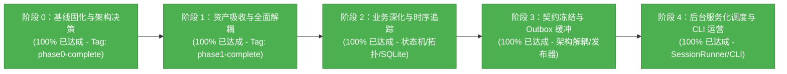

# 智能建造安全感知系统 (Perception) 当前进展报告

> **报告版本**：v5.0 (Headless Service & CLI Operational Complete)  
> **更新时间**：2026-09-25  
> **当前里程碑**：  
> - **阶段 0：基线固化与架构决策 (Phase 0) —— 100% 完成 (Git Tag: `phase0-complete`)**  
> - **阶段 1：资产吸收与全面解耦 (Phase 1) —— 100% 完成 (Git Tag: `phase1-complete`)**  
> - **阶段 2：业务深化与时序追踪 (Phase 2) —— 100% 完成**  
> - **阶段 3：跨系统契约冻结、Outbox 离线缓冲与硬编码专项治理 —— 100% 完成**  
> - **阶段 4：无头后台监控调度、周期性心跳、动态配置轮询与 CLI 工具链 —— 100% 完成**  
> **测试状态**：感知模块 **43 项**自动化单元与集成测试全部通过（全项目 **52 项**通过率 100%）！

---

## 1. 里程碑概览与当前阶段状态

本项目的目标是将 Fork 的 `Smart_Construction` 消化、吸收并重构为母工程 `civil_engineering_agent` 的高可靠、模块化感知子系统（`perception/`）。

目前已顺利达成**阶段 0、阶段 1、阶段 2、阶段 3 以及阶段 4（无头服务化与终端运营）的全部目标**：
- **阶段 0**：建立运行时环境矩阵、Pydantic 契约、纯 Python 追踪引擎、高精度脚底触地几何算法，通过自动化单测与 CPU 冒烟。
- **阶段 1**：Qt GUI 与图标资产迁移、数据工程脚本迁移、实现官方模块 `UltralyticsDetector`、双模型回归验证，并彻底物理删除旧工程目录。
- **阶段 2**：
  1. **单调时钟防抖状态机与滞留超时告警**：消除电子围栏边缘抖动，支持连续进入防抖、离开冷却与滞留超时告警；
  2. **“人-头-帽”空间拓扑匹配**：通过人体解剖学上部区域与匈牙利全局二分匹配算法，实现人体佩戴安全帽的严密逻辑判定；
  3. **SQLite 违规事件持久化与快照截图存储**：事件自动入库，自动在图片上渲染危险区遮罩、违规人员框、时间戳及警告横幅；
  4. **端到端一体化安全感知流水线 (`SafetyPerceptionPipeline`)**：打通检测、拓扑绑定、追踪、状态机防抖与存储存档。
- **阶段 3（契约与治理）**：
  1. **联合集成契约（Contract v1）**：冻结跨系统联调 4 个关键细节（单 `event_uuid` 生命周期不变量、UTC 时间锚点转换、防抖配置化、独立 Outbox 表）；
  2. **Outbox 离线存储与发布器**：实现带指数退避、422 终态错误过滤与幂等性的 `PerceptionEventPublisher`；
  3. **架构与硬编码整治**：解决多相机 ByteTrack ID 串扰、计算设备动态适配、类别标签语义解耦；
  4. **测试体系重构**：将所有感知测试归类至 `tests/perception/`，保持与 `tests/agent/` 统一规范；
  5. **消除状态上报 422 阻塞项**：对齐 Agent 状态模型校验需求，成功打通状态上行。
- **阶段 4（服务化与 CLI 运营交付）**：
  1. **无头监控会话调度器 (`CameraSessionRunner`)**：支持无桌面后台运行 RTSP/本地视频流，自动维护 `monitor_session_id` 与时间锚点；
  2. **周期性心跳与动态配置轮询**：每 5 秒滑动统计 FPS、在线工人数与安全帽佩戴合规率，定时向 Agent 上报状态并刷新 Outbox；定期轮询配置版本，支持围栏防抖参数热更新；具备优雅降级（Graceful Fallback）兜底能力；
  3. **标准相对快照 URI 规范**：全链路统一为 `snapshots/YYYYMMDD/{event_uuid}.jpg` 契约格式；
  4. **感知层终端命令行 (`perception/cli.py`)**：提供 `run` 和 `report` 命令行工具，支持信号捕获与优雅停机；
  5. **感知服务中枢契约 (`CivilSafetyPerceptionService`)**：实现母工程架构定义的监控启动/停止、状态查询及日报生成结构化输出。



---

## 2. 阶段 4 核心交付物详解 (Phase 4 Deliverables)

### 2.1 无头监控会话调度器与中枢服务 (`perception/services/session_runner.py`)
- **`CameraSessionRunner`**：
  - 彻底摆脱 Qt/GUI 依赖，在后台专属守护线程中运行解码、检测、追踪、状态机防抖与快照归档全流程；
  - 自动生成 `session_{camera_id}_{timestamp}` 会话 ID 与初始时间锚点 `TimeAnchor`；
  - 支持循环回放模式 (`loop_video`) 与帧率限制 (`fps_throttle`)，完美适配现场真实 RTSP 流或离线仿真视频。
- **`CivilSafetyPerceptionService`**：
  - 符合 `docs/perception/Smart_Construction_Refactoring_Plan.md` 第 5 节的母工程集成契约；
  - 提供 `start_monitoring(camera_id, stream_url, zones_config)` 多路并发管理；
  - 提供 `stop_monitoring(camera_id)` 与 `stop_all()` 清理能力；
  - 提供轻量巡检查询 `query_safety_status(camera_id)`；
  - 提供 `generate_daily_safety_report(date_str)`，按指定日期聚合 SQLite 违规事件，输出包含违规类型分布、严重度分布、分相机统计及各事件快照 URI 的结构化指标，供 LLM 撰写安全巡检日报。

### 2.2 周期性心跳与动态配置轮询 (Periodic Heartbeat & Config Polling)
- **心跳守护 (Heartbeat Daemon)**：
  - 默认每 5 秒滑动窗口统计瞬时 FPS、当前追踪工人数 `active_workers_count` 和安全帽佩戴合规率 `helmet_compliance_rate`；
  - 构造合规的 `CameraStatusContractV1` 上报至 Agent `PUT /internal/v1/perception/cameras/{camera_id}/status`；
  - 在正常停机或收到终止信号时，自动上报 `is_online=False` 离线心跳；
  - 心跳周期自动附带触发 Outbox 积压事件刷新 (`flush_outbox()`)。
- **动态配置在线轮询与热重载 (Dynamic Config Poller)**：
  - 默认每 30 秒轮询 Agent 配置接口；当检测到 `config_version` 递增时，自动提取多边形顶点与防抖参数，调用 `pipeline.update_config()` 实现不停机热更新；
  - **优雅降级 (Graceful Fallback)**：当 Agent 配置接口返回 404 或不可用时，系统自动回退至本地 `perception/configs/default_danger_zones.json`，确保核心视频流安全检测与事件上报链路永不阻塞。

### 2.3 标准相对快照 URI 规范对齐
- **全链路格式固化**：统一采用 `snapshots/YYYYMMDD/{event_uuid}.jpg` 契约格式；
- **存储与转换双向支持**：
  - [`EventStore._archive_snapshot()`](file:///home/jjc/projects/python/civil_engineering_agent/perception/storage/event_store.py) 生成统一相对路径并持久化；
  - [`EventStore.get_snapshot_full_path()`](file:///home/jjc/projects/python/civil_engineering_agent/perception/storage/event_store.py) 兼容相对路径在本地媒体目录中的物理定位；
  - [`to_event_contract_v1()`](file:///home/jjc/projects/python/civil_engineering_agent/perception/schemas/contract_v1.py) 与流水线发布严格传递标准化相对 URI，严禁暴露宿主机绝对路径。

### 2.4 感知层终端命令行工具 (`perception/cli.py`)
- **运行命令 (`python -m perception.cli run`)**：
  ```bash
  python -m perception.cli run \
    --camera-id cam_crane_01 \
    --source tests/fixtures/sample_walk.mp4 \
    --agent-url http://127.0.0.1:8000 \
    --device auto
  ```
  - 支持参数覆盖（`--weights`、`--device`、`--zones-config`、`--heartbeat-interval` 等）；
  - 注册 `SIGINT` (Ctrl+C) 与 `SIGTERM` 信号监听，退出时自动触发安全停止与离线心跳上报。
- **日报生成命令 (`python -m perception.cli report`)**：
  ```bash
  python -m perception.cli report --date 2026-09-25 --event-db data/events.db
  ```
  - 直接从本地 SQLite 输出规范 JSON 日报数据。

---

## 3. 测试体系与通过情况

所有测试模块已全面覆盖阶段 0 至阶段 4，全套测试用例持续维持 **100% 通过率**。

### 3.1 测试目录分类

```text
tests/
├── conftest.py                    # 统一 sys.path 根目录注入
├── fixtures/                      # 共享真值视频、图片与标注资产
├── agent/                         # Agent 智能体闭环测试 (9 项)
└── perception/                    # 感知模块专区 (43 项)
    ├── test_cli.py                # CLI 参数解析与终端报告验证
    ├── test_data_tools.py         # 数据标注与格式转换
    ├── test_detector_interface.py # BaseDetector 抽象与 Mock 验证
    ├── test_event_store.py        # SQLite 本地事件库与快照生成
    ├── test_geometry.py           # 空间多边形判定与双向坐标映射
    ├── test_integration_contract.py # 契约 Schema、TimeAnchor、Outbox 投递与状态上报对齐
    ├── test_regression.py         # YOLO 适配器回归推理验证
    ├── test_safety_pipeline.py    # 完整感知流水线与 Outbox 集成
    ├── test_schemas.py            # 数据契约 Schema 属性与序列化
    ├── test_session_runner.py     # 无头会话生命周期、心跳上报、降级轮询与感知中枢服务
    ├── test_state_machine.py      # 防抖状态机、滞留超时与多区域状态
    ├── test_topology.py           # 人头帽解剖拓扑与自定义类别匹配
    ├── test_tracker.py            # ByteTrack 跨帧关联与多实例隔离
    └── test_video_pipeline.py     # 真实视频真值一致性
```

### 3.2 测试执行结果（100% 通过）

- **感知测试子集**：`python3 -m pytest tests/perception/ -v` $\to$ **43 passed**
- **全项目自动化测试**：`python3 -m pytest tests/ -v` $\to$ **52 passed, 0 failed**

---

## 4. 下一步演进计划 (Next Steps)

1. **CV 与 Agent 端到端实机全链路演练**：
   - 启动本地 Agent FastAPI 服务（含 MySQL/SQLite 测试库）；
   - 使用 `python -m perception.cli run` 连接真实 Agent 服务，实时观测事件入库与心跳刷新；
   - 验证 Web 页面及 LangGraph 对话获取最新安全巡检事件与媒体快照。
2. **多机位流媒体接入拓展**：
   - 支持 RTSP 网络流掉线自动指数退避重连机制；
   - 部署生产环境 Dockerfile 容器化镜像构建方案。
