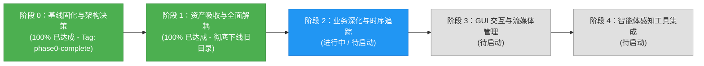

# 智能建造安全感知系统 (Perception) 当前进展报告

> **报告版本**：v2.0 (Phase 1 Complete)  
> **更新时间**：2026-09-25  
> **当前里程碑**：  
> - **阶段 0：基线固化与架构决策 (Phase 0) —— 已 100% 完成 (Git Tag: `phase0-complete`)**  
> - **阶段 1：资产吸收与全面解耦 (Phase 1) —— 已 100% 完成**  
> **历史工程解耦**：`Smart_Construction/` 目录已完全吸收并安全下线，感知系统实现 100% 独立自包含！

---

## 1. 里程碑概览与当前阶段状态

本项目的目标是将 Fork 的 `Smart_Construction`（早期 YOLOv5 智能工地视觉检测项目）消化、吸收并重构为母工程 `civil_engineering_agent` 的高可靠、模块化感知子系统（`perception/`）。

目前已顺利完成了前置的**阶段 0（基线固化）**与**阶段 1（资产平移吸收与全面解耦）**：
- **阶段 0**：建立了运行时环境矩阵、Pydantic 契约、纯 Python 追踪引擎、高精度脚底触地几何算法，并通过了 100% 自动单元测试与 CPU 端到端冒烟验证。
- **阶段 1**：将 Qt GUI 界面与图标迁移至 `perception/gui/`、数据工程脚本迁移至 `perception/data_tools/`、实现基于官方模块的 `UltralyticsDetector`、完成双检测器回归评测，并彻底下线了旧版 `Smart_Construction/` 目录。



---

## 2. 阶段 1 核心成果详述 (Phase 1 Deliverables)

### 2.1 Qt 界面与图标资产迁移 (`perception/gui/`)
- **资产平移**：将原 `Smart_Construction/UI/` 下的 `main_window.ui`、`main_window.py` 及图标素材（`play.png`、`pause.png`、`icon.ico`）迁移至 `perception/gui/`；
- **桌面端主程序现代化重构 (`perception/gui/app.py`)**：
  - **跨平台路径**：全面基于 `pathlib.Path` 动态定位，彻底消除 Windows 反斜杠硬编码；
  - **硬件弹性监控**：重构 `get_hardware_info()`，首选 `GPUtil` 探查 GPU 状态，在无独显、无驱动或容器环境中自动平滑降级至 `psutil` 汇报 CPU 与内存占用，杜绝启动崩溃；
  - **检测器解耦与自适应加载**：优先自动加载主业务模型 `helmet_head_person_m.pt`，备选 `helmet_head_person_s.pt` 或 `yolov8n.pt`，无权重时自适应回退至 `MockDetector`。

### 2.2 数据工程工具迁移 (`perception/data_tools/`)
- **`voc_to_yolo.py`**：将 VOC 格式 XML 标定文件批量转换为 YOLO 归一化 xywh 格式，规范映射类别 `head` (1) 与 `helmet` (2)；
- **`label_merger.py`**：实现自动合并伪标签工具，支持将大模型推理出的 `person` (0) 类别自动对齐追加到目标数据集标注中，消除原有绝对路径 `E:\...` 依赖；
- **测试覆盖**：新增 [`tests/test_data_tools.py`](file:///home/jjc/projects/python/civil_engineering_agent/tests/test_data_tools.py)，覆盖坐标归一化公式与多源标签合并逻辑。

### 2.3 现代化检测器实现 (`perception/detectors/ultralytics_detector.py`)
- 基于环境中已安装的官方 `ultralytics 8.4.x` 引擎，实现统一 `BaseDetector` 接口的 `UltralyticsDetector`；
- 支持开箱即用加载 YOLOv8、YOLOv11 等现代权重（如 `yolov8n.pt`），输出标准 `DetectionResult` 契约结构体。

### 2.4 双适配器回归对比与测试通过 (`tests/test_regression.py`)
- 编写双模型回归测试用例：
  - `test_legacy_yolo_adapter_regression`：验证旧版 `helmet_head_person_m.pt` 业务三分类推理正确性与脚底入侵触发；
  - `test_ultralytics_detector_regression`：验证现代 `UltralyticsDetector` 推理链路与契约一致性；
- **自动化测试结果**：14 项测试全部通过（通过率 **100%**）。

### 2.5 彻底下线 `Smart_Construction/`
- 在确认 GUI、数据工具、模型加载和自动化测试完全不再依赖 `Smart_Construction/` 之后，正式执行物理删除；
- 旧工程历史已通过 Git Bundle（`.git_archive/Smart_Construction_8867a0b.bundle`）与 `phase0-complete` Git Tag 获得永久保存。

---

## 3. 测试与验证通过情况

### 3.1 Pytest 单元与回归测试集（14 项全部通过）
运行命令：`python3 -m pytest tests/ -v`，用时 5.82 秒：
```text
tests/test_data_tools.py::test_voc_bbox_to_yolo_xywh PASSED              [  7%]
tests/test_data_tools.py::test_voc_xml_conversion_and_merge PASSED       [ 14%]
tests/test_detector_interface.py::test_mock_detector_interface PASSED    [ 21%]
tests/test_geometry.py::test_point_in_polygon PASSED                     [ 28%]
tests/test_geometry.py::test_person_in_danger_zone_feet_detection PASSED [ 35%]
tests/test_geometry.py::test_gui_coordinate_mapping_roundtrip PASSED     [ 42%]
tests/test_geometry.py::test_load_danger_zones_from_json PASSED          [ 50%]
tests/test_regression.py::test_legacy_yolo_adapter_regression PASSED     [ 57%]
tests/test_regression.py::test_ultralytics_detector_regression PASSED    [ 64%]
tests/test_schemas.py::test_bounding_box_properties PASSED               [ 71%]
tests/test_schemas.py::test_detection_result_serialization PASSED        [ 78%]
tests/test_schemas.py::test_violation_event_creation PASSED              [ 85%]
tests/test_tracker.py::test_byte_tracker_association PASSED              [ 92%]
tests/test_video_pipeline.py::test_sample_walk_video_ground_truth_consistency PASSED [100%]
======================== 14 passed, 9 warnings in 5.82s ========================
```

### 3.2 性能口径统一说明 (Performance Benchmark Clarification)
- **冷启动总耗时**：约 **2.0 ~ 2.5 秒**（包含 PyTorch 核心加载、旧版 YOLOv5 模型反序列化与多层算子 Fusing 开销）；
- **单帧前向推理耗时**：
  - CPU 环境：主模型 `helmet_head_person_m.pt` 约为 **159 ~ 178 ms**；备用模型 `helmet_head_person_s.pt` 约为 **87 ms**；
  - 纯 Mock 虚拟检测器：**8.87 ms**；
- **PyTorch 警告说明**：旧版权重加载时打印的 `SourceChangeWarning` 与 `meshgrid` 警告为 PyTorch 1.5 权重在 PyTorch 2.x 下反序列化的正常向下兼容提示，后续迁移至 Ultralytics 格式权重后将彻底消除。

---

## 4. 当前代码库全新拓扑结构

```text
civil_engineering_agent/
├── perception/                         # 【自包含感知子系统】
│   ├── configs/                        # 集中式配置
│   ├── data_tools/                     # 数据格式转换与伪标签合并 (voc_to_yolo, label_merger)
│   ├── detectors/                      # 统一检测器实现 (BaseDetector, Legacy, Ultralytics)
│   │   ├── base.py
│   │   ├── legacy_yolo_adapter.py
│   │   ├── ultralytics_detector.py
│   │   └── yolov5_legacy/              # 自包含遗留 YOLOv5 模型架构
│   ├── geometry/                       # 高精度脚底触地空间计算与坐标映射
│   ├── gui/                            # 现代化 PyQt5 桌面端应用与图标素材
│   │   ├── app.py
│   │   └── UI/                         # main_window.ui, icon/
│   ├── schemas/                        # Pydantic v2 强类型契约
│   ├── tracking/                       # ByteTrack 纯 Python 多目标追踪引擎
│   └── weights/                        # 模型权重与 SHA256 验签清单
├── docs/                               # 规范文档中心
│   ├── README.md                       # 文档中心总览
│   └── perception/                     # 感知系统专区
├── tests/                              # 自动化测试套件 (14 项单测与回归测试)
├── scripts/                            # 冒烟与基线生成脚本
├── requirements*.lock                  # 依赖锁定文件
└── .gitignore                          # 根目录全局过滤规则
```

---

## 5. 后续阶段规划 (Phase 2 & Beyond)

- **阶段 2（业务深化与时序追踪）**：
  - 单调时钟防抖状态机与滞留超时告警（$T_{alarm}=5s$）；
  - SQLite 违规事件持久化与快照截图存储；
  - “人-头-帽”空间拓扑树绑定（严格判定人身帽子佩戴合规性）。
- **阶段 3（GUI 交互与流媒体管理）**：
  - GUI 播放器支持鼠标点击实时绘制/编辑电子围栏多边形；
  - 多路 RTSP 监控流配置与断线重连守护线程。
- **阶段 4（母工程 Agent 工具化接入）**：
  - 封装 `CivilSafetyPerceptionService` 标准工具接口；
  - 支撑 LLM 智能体自主调用执行巡检与安全日报生成。
