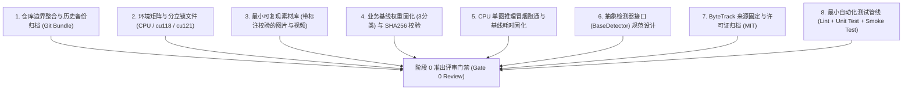
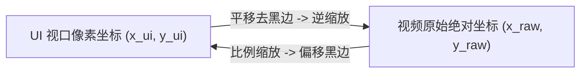

# Smart_Construction 系统重构实施规格说明书 (Refactoring Specification)

> **评审结论与开工门禁**：
> - **整体评估**：有条件开工，当前整体开工准备度约 **55%**。
> - **执行策略**：**严禁直接按原计划全面并行实施**。必须首先执行并闭环 **“阶段 0：基线固化与架构决策”**，达成门禁验收标准后，方可正式签发阶段一工程任务。
> - **设计原则**：消除“多选一”模糊空间，全面落地为确定性技术选型、量化验收门槛（DoD）与可拆票执行的技术规格。

---

## 1. 核心技术选型确定性决策表 (Architectural Decisions)

为了规避后期技术重构与返工风险，对原方案中的开放式选项做出强制性确定性收敛：

| 决策领域 | 选定方案 | 废弃/备选方案 | 决策依据与工程考量 |
| :--- | :--- | :--- | :--- |
| **仓库集成形态** | **单体多包并入 (Monorepo)** | Git Submodule / Subtree | 外层 `civil_engineering_agent` 是主项目，Smart_Construction 应作为其内置子模块（直接管理源码），消除嵌套 Git 仓库导致的 CI、提交混乱与版本脱节。 |
| **检测器抽象架构** | **统一 `BaseDetector` 抽象接口** | 深度绑定 YOLOv5 或直接推倒重写 | 立即定义抽象基类 `BaseDetector`。阶段 0~1 基于现有 YOLOv5 实现 `LegacyYOLOv5Adapter`，业务逻辑、追踪算法与 GUI 仅依赖抽象接口，后续升级 Ultralytics 无需修改业务代码。 |
| **空间几何计算** | **OpenCV `cv2.pointPolygonTest`** | Shapely 纯 Python 几何库 | OpenCV 是系统固有依赖（零新增依赖），其底层为优化的 C++ 实现，对高频点面相交判定性能显著优于 Python 纯几何库。 |
| **日志框架** | **标准库 `logging` + 集中式配置** | `loguru` 第三方库 | 标准库 `logging` 无任何环境兼容与打包额外开销，通过 `logging.config.dictConfig` 统一配置格式化器、轮转文件与控制台输出。 |
| **多目标追踪选型** | **纯 Python ByteTrack (MIT 协议，锁定仓库与 commit)** | C++ 绑定版 ByteTrack / DeepSORT | 选用纯 Python+NumPy 实现的 ByteTrack，明确固定源仓库 `ifzhang/ByteTrack` (Tag `v0.3.2` / Commit `174a799`)，自带独立 MIT 许可证，避免 Cython/C++ 跨平台构建编译风险。 |
| **智能体接入架构** | **分层架构：Python SDK Tool 为核心，FastAPI 为可选服务** | 仅纯脚本 / 仅 Web 远程服务 | 核心以 Python 原生 Class 交付（直接供母工程 Agent 零网络开销调用）；同时暴露轻量 FastAPI 包装器供分布式/微服务场景使用。 |
| **数据校验与通信** | **Pydantic v2 Schema** | 原生 dict 传递 | 强类型数据校验，为智能体感知输入、输出与违规事件提供确定性结构体。 |
| **事件持久化** | **SQLite 本地嵌入式数据库 + JSONL 归档** | 纯文本追加 / 重型 MySQL | 轻量、无外部服务依赖，支持并发连接、事务安全与按时间窗口快速索引。 |

---

## 2. 阶段 0：基线固化与架构决策 (Phase 0: Baseline & Architecture)

> **目标**：在 3~5 个工作日内建立可复现测试基线、统一仓库拓扑、锁定运行时环境，将开工准备度提升至 **95%+**。

### 2.1 阶段 0 的 8 项关键交付物 (Deliverables)



#### 交付物 1：仓库边界整合与提交历史可恢复备份
- **背景与原则**：严禁在未记录历史和未备份的情况下直接删除 `Smart_Construction/.git`。
- **历史记录固化**：
  - 远端地址 (Remote URL)：`https://github.com/jjc303/Smart_Construction.git`
  - 当前提交哈希 (Commit Hash)：`8867a0b27b15ad86f725019258a1e2b34e001d78`
  - 提交信息：`Update README.md` (Author: HinGwenWoong <peterhuang0323@qq.com>, Date: 2023-03-07)
- **备份与归档实施步骤**：
  1. 在删除内部 `.git` 之前，在母仓库创建安全归档包：
     ```bash
     mkdir -p .git_archive
     git -C Smart_Construction bundle create ../.git_archive/Smart_Construction_8867a0b.bundle --all
     ```
  2. 保存子仓库元数据信息至 `docs/legacy_meta.json`；
  3. 执行内部 `.git` 清理，并将源码纳入母仓库统一跟踪：
     ```text
     civil_engineering_agent/
     ├── civil_agent/               # 母工程核心智能体逻辑
     ├── perception/                # 感知子系统（原 Smart_Construction 重命名并规范化）
     │   ├── configs/               # 集中式配置
     │   ├── detectors/             # 检测器抽象及实现
     │   ├── tracking/              # 追踪引擎 (含 ByteTrack 纯 Python 实现及 LICENSE)
     │   ├── geometry/              # 空间几何计算
     │   ├── gui/                   # 可视化桌面端
     │   └── schemas/               # 协议与数据结构
     ├── docs/                      # 架构设计与文档
     └── tests/                     # 自动化测试套件
     ```

#### 交付物 2：环境矩阵细化与分立锁文件
- **废弃泛化的 `torch>=2.0`**，按目标硬件平台生成清晰独立的环境矩阵与锁文件：
  - **CPU 环境（开发、基础 CI）**：
    - 安装源：`--extra-index-url https://download.pytorch.org/whl/cpu`
    - 依赖：`torch==2.1.2+cpu`、`torchvision==0.16.2+cpu`
    - 锁定文件：`requirements-cpu.lock`
  - **CUDA 11.8 环境（工业边缘端、工控机、传统 GPU 节点）**：
    - 安装源：`--extra-index-url https://download.pytorch.org/whl/cu118`
    - 依赖：`torch==2.1.2+cu118`、`torchvision==0.16.2+cu118`
    - 锁定文件：`requirements-cu118.lock`
  - **CUDA 12.1 环境（现代化深度学习服务器、新一代工作站）**：
    - 安装源：`--extra-index-url https://download.pytorch.org/whl/cu121`
    - 依赖：`torch==2.1.2+cu121`、`torchvision==0.16.2+cu121`
    - 锁定文件：`requirements-cu121.lock`
- **通用 Python 基线**：统一锁定至 **Python 3.10.x**。

#### 交付物 3：可复现最小测试素材库
- 在 `tests/fixtures/` 下固化基线资产：
  - `sample_site.jpg`：包含 `person`、`head`、`helmet` 的现场施工图片各至少 2 个。
  - `sample_site.json`：包含预设多边形危险区域坐标的真值。
  - `sample_walk.mp4`：一段时长 10 秒、分辨率 1280×720 的人员走入危险区域测试视频（包含进出全过程）。
  - `ground_truth.json`：标定该测试素材的真实边界框、目标 ID 与进入/离开时间戳。

#### 交付物 4：业务基线权重与 SHA256 完整性固化
- **区分两级权重体系**：
  1. **链路验证冒烟权重**：COCO `yolov5s.pt`（仅用于冷启动验证网络前向推理张量通路正常，不可用于业务评测）。
  2. **业务基准回归权重 (Mandatory)**：必须是作者原先在 `SHWD` 扩增数据集上训练产出的 **`person` / `head` / `helmet` 三分类专属权重**（如 `weights/helmet_head_person_s.pt`），具有已知的基准精度指标。
- **强制哈希验签**：在 `weights/checksums.sha256` 中固化哈希值，检测器初始化时强制执行校验：
  ```bash
  sha256sum weights/helmet_head_person_s.pt > weights/checksums.sha256
  ```

#### 交付物 5：CPU 单图推理冒烟跑通与基线耗时固化
- 实现纯命令行冒烟脚本 `scripts/smoke_test_cpu.py`（不依赖 GPU、不依赖 PyQt5）。
- 记录基线指标：在标准 x86 CPU 上单图（640×640）预处理、推理与 NMS 的基准耗时，并保存基线输出图 `tests/fixtures/baseline_output.jpg` 作为后续重构等价性参考。

#### 交付物 6：统一检测器接口 (`BaseDetector`)
在代码中固化抽象接口，为后续模型无缝升级打下隔离层：
```python
from abc import ABC, abstractmethod
import numpy as np
from perception.schemas.detection import DetectionResult

class BaseDetector(ABC):
    @abstractmethod
    def load_model(self, weights_path: str, device: str = "cpu") -> None:
        """加载模型权重并初始化"""
        pass

    @abstractmethod
    def detect(self, image: np.ndarray, conf_threshold: float = 0.4, iou_threshold: float = 0.5) -> DetectionResult:
        """输入单帧 BGR 图片，输出结构化检测结果"""
        pass
```

#### 交付物 7：Pydantic 协议与数据结构契约
明确统一的核心数据结构，杜绝各模块间传递非结构化字典：
```python
from pydantic import BaseModel, Field
from typing import List, Optional, Tuple

class BoundingBox(BaseModel):
    x1: float
    y1: float
    x2: float
    y2: float
    conf: float
    class_id: int
    class_name: str

class DetectionResult(BaseModel):
    frame_id: int
    timestamp: float
    boxes: List[BoundingBox]
    inference_time_ms: float

class TrackedPerson(BaseModel):
    track_id: int
    bbox: BoundingBox
    feet_point: Tuple[float, float]
    has_helmet: bool
    is_in_danger_zone: bool
    danger_zone_name: Optional[str] = None
    dwell_time_seconds: float = 0.0
```

#### 交付物 8：ByteTrack 来源固定与最小自动化测试流水线
- **ByteTrack 来源固定**：
  - 源码来源：基于 `https://github.com/ifzhang/ByteTrack` 纯 Python/NumPy 核心算法提取（Tag: `v0.3.2` / Commit: `174a799`）。
  - 开源合规：将官方原始 `MIT License` 保存至 `perception/tracking/LICENSE`。
- **自动化测试套件**：
  - 搭建 `pytest` 测试框架。
  - 编写 `tests/test_geometry.py`（几何点面判定单测）和 `tests/test_detector_interface.py`（CPU 冒烟测试）。

---

## 3. 详细架构与关键技术方案可执行设计

### 3.1 空间入侵判定与脚底触地点算法规格

#### 1) 触地点计算标准
在建筑工地监控视角（通常为斜上方俯视）下，人体在地面投影的实际位置由双脚决定。统一使用底边中点作为基准脚底接地点：
$$P_{feet} = \left( x_1 + \frac{x_2 - x_1}{2}, \quad y_2 \right)$$

为防止单点判定的边缘抖动，采用**双重校验机制**：
- **核心判定点**：$P_{feet}$（权重 70%）。
- **辅助边缘点**：底边左 1/4 点与右 1/4 点 $(x_1 + 0.25w, y_2)$ 与 $(x_1 + 0.75w, y_2)$。
- 只要有任意 2 个点落在多边形内，即判定为踏入危险区。

#### 2) `cv2.pointPolygonTest` 高效判定
```python
def check_point_in_polygon(contour: np.ndarray, pt: Tuple[float, float]) -> bool:
    """
    使用 OpenCV 原生 C++ 接口判定点是否在多边形内部
    :param contour: 多边形顶点数组，形状为 (N, 1, 2)，np.int32
    :param pt: 待检测点 (x, y)
    :return: True (在内部或边缘), False (在外部)
    """
    # measureDist=False 返回 +1 (内部), 0 (边缘), -1 (外部)
    return cv2.pointPolygonTest(contour, pt, measureDist=False) >= 0
```

### 3.2 视频缩放与 GUI 坐标系双向映射数学规格

在 GUI 播放器中，输入视频通常会按等比例自适应缩放（Letterbox / Aspect-Ratio Fit），导致 GUI 控件坐标系与视频原始分辨率不一致。用户在 UI 上点击绘制的多边形必须经过精确变换才能映射回原始视频帧。



**数学转换模型**：
设原始视频尺寸为 $(W_{raw}, H_{raw})$，播放器视口尺寸为 $(W_{ui}, H_{ui})$。
1. 计算缩放比与黑边偏移（Padding）：
   $$scale = \min\left( \frac{W_{ui}}{W_{raw}}, \frac{H_{ui}}{H_{raw}} \right)$$
   $$pad_x = \frac{W_{ui} - W_{raw} \times scale}{2}, \quad pad_y = \frac{H_{ui} - H_{raw} \times scale}{2}$$
2. **UI 鼠标坐标映射为视频帧坐标**：
   $$x_{raw} = \text{clamp}\left(\frac{x_{ui} - pad_x}{scale}, \ 0, \ W_{raw} - 1\right)$$
   $$y_{raw} = \text{clamp}\left(\frac{y_{ui} - pad_y}{scale}, \ 0, \ H_{raw} - 1\right)$$
3. **量化验收标准**：由于屏幕像素与真实视频坐标之间存在浮点数取整（Rounding），双向往返映射转换（UI $\to$ 视频帧 $\to$ UI）的数值误差在取整后满足 $\le 1$ 像素。

### 3.3 事件持久化、单调时钟防抖去重与生命周期状态机

#### 1) 基于单调时钟与帧时间戳（PTS）的防抖计时
> **时间基准规范**：严禁采用“按固定帧数估算时间”（如“5 帧约 0.2 秒”仅对固定 25 FPS 有效）。系统必须严格采用真实时间基准：
> - **实时流（RTSP/Webcam）**：采用系统单调时钟 `time.monotonic()`，不受系统时间回调影响。
> - **离线文件（MP4/AVI）**：采用视频流解码提供的帧显示时间戳 **PTS (Presentation Timestamp)**。

- **触发确认窗口**：同一 `track_id` 连续处于危险区域的时间累计超过 $T_{enter} = 0.2$ 秒，才确认触发 `ENTER_ZONE` 事件。
- **滞留告警梯度**：
  - 踏入确认：级别 `WARNING`（橙色警示）；
  - 停留时间 $t_{current} - t_{enter} \ge T_{alarm}$ 秒（默认 5.0 秒）：升级为 `CRITICAL`（红色严重告警、声光报警）；
- **离开确认窗口**：同一 `track_id` 在区域内连续缺失超过 $T_{exit} = 0.6$ 秒，确认触发 `EXIT_ZONE`，结算滞留总时长并写入归档数据库。

#### 2) SQLite 数据库设计
```sql
CREATE TABLE IF NOT EXISTS violation_events (
    id INTEGER PRIMARY KEY AUTOINCREMENT,
    event_uuid TEXT UNIQUE NOT NULL,
    track_id INTEGER NOT NULL,
    camera_id TEXT NOT NULL,
    violation_type TEXT NOT NULL,      -- 'NO_HELMET', 'DANGER_ZONE_INTRUSION'
    zone_name TEXT,
    start_time TIMESTAMP NOT NULL,
    end_time TIMESTAMP,
    duration_seconds REAL DEFAULT 0.0,
    snapshot_path TEXT,
    video_clip_path TEXT,
    status TEXT NOT NULL               -- 'ACTIVE', 'RESOLVED', 'FALSE_ALARM'
);
CREATE INDEX IF NOT EXISTS idx_time_camera ON violation_events (camera_id, start_time);
```

---

## 4. 各阶段量化准入/准出标准 (Definition of Done - DoD)

| 阶段 | 准入条件 (Entry Criteria) | 核心任务 | 交付物与量化验收门槛 (DoD) |
| :--- | :--- | :--- | :--- |
| **阶段 0**<br/>基线与架构 | 代码已审计，批准开工 | 8 项基线固化与架构选型 | 1. 消除嵌套 Git 前完成 `git bundle` 归档并生成 `legacy_meta.json`；<br/>2. 依赖矩阵分立锁文件 (`requirements-cpu.lock` 等) 零报错安装；<br/>3. CPU 冒烟单测通过，固化三分类业务权重与 SHA256 校验和；<br/>4. `tests/` 单测覆盖几何计算，通过率 100%；<br/>5. ByteTrack 来源与 MIT License 归档；<br/>6. 评审确认统一检测器抽象与 Pydantic 协议。 |
| **阶段 1**<br/>工程代码重构 | 阶段 0 门禁全部通过 | 全面规范化改造与自适应适配 | 1. 代码内 0 处绝对路径和 Windows 双反斜杠；<br/>2. 无 GPU 环境下 GUI 与推理自适应回退，启动崩溃率 0%；<br/>3. 实现并验证 `LegacyYOLOv5Adapter` 接入 `BaseDetector`；<br/>4. 日志体系规范，关键步骤有级别明确的日志输出。 |
| **阶段 2**<br/>核心算法升级 | 阶段 1 门禁全部通过 | 脚底触地算法、ByteTrack 追踪集成 | 1. 几何算法与旧算法相比，边缘切入场景漏报率降低 $\ge 15\%$；<br/>2. ByteTrack ID 切换率（ID Switch Rate）$\le 5\%$；<br/>3. 视频连续追踪支持目标离开后 30 帧内重连恢复；<br/>4. 滞留超时计时基于单调时钟/PTS，误差 $\le 0.1$ 秒。 |
| **阶段 3**<br/>交互系统革新 | 阶段 2 门禁全部通过 | 动态绘制电子围栏、流管理、Webhook | 1. GUI 支持鼠标实时绘制/编辑多边形，双向坐标映射取整后误差 $\le 1$ 像素；<br/>2. RTSP 监控流断网模拟测试下，5 秒内检测到断线并自动执行指数退避重试；<br/>3. 连续播放 2 小时高清视频流，系统内存增长 $\le 50\text{ MB}$（无句柄与帧泄漏）。 |
| **阶段 4**<br/>现代迁移与生态 | 阶段 3 门禁全部通过 | 升级 Ultralytics YOLO，对接 Agent | 1. 实现 `UltralyticsDetector`，业务层零代码改动平滑替换；<br/>2. 在 NVIDIA RTX 3060 (或对应算力卡) 上，TensorRT 单路 1080P 视频流处理帧率稳定 $\ge 60\text{ FPS}$；<br/>3. 封装标准 Agent Tool，母工程 Agent 能通过 API 调取违规统计报告与巡检快照。 |

---

## 5. 母工程 (Civil Engineering Agent) 集成契约

在 `civil_agent` 中，智能体通过标准化 Python API 与感知模块进行交互，定义如下生命周期与调用契约：

```python
from typing import Dict, Any, List
from datetime import datetime

class CivilSafetyPerceptionService:
    """智能建造安全感知中枢服务契约"""

    def start_monitoring(self, camera_id: str, stream_url: str, zones_config: List[dict]) -> bool:
        """启动特定摄像头的后台连续监控任务"""
        ...

    def stop_monitoring(self, camera_id: str) -> bool:
        """停止特定摄像头的监控任务"""
        ...

    def query_safety_status(self, camera_id: str) -> Dict[str, Any]:
        """
        供 Agent 定时巡检调用的轻量状态查询接口
        返回数据模型:
        {
            "camera_id": "cam_crane_01",
            "timestamp": "2026-09-25T10:30:00",
            "active_workers_count": 8,
            "helmet_compliance_rate": 0.875,
            "active_violations": [
                {
                    "track_id": 102,
                    "type": "DANGER_ZONE_INTRUSION",
                    "zone_name": "吊装禁行区",
                    "dwell_time_seconds": 12.4,
                    "severity": "CRITICAL"
                }
            ]
        }
        """
        ...

    def generate_daily_safety_report(self, date_str: str) -> Dict[str, Any]:
        """按日期聚合 SQLite 违规事件表，生成供 LLM 撰写安全日报的结构化指标"""
        ...
```

---

## 6. 即刻可执行的行动项清单 (Next Steps - Phase 0 执行启动)

```text
[ ] 任务 0.1：记录 Smart_Construction 提交 (8867a0b) 与 remote，生成 .git_archive 备份包后并入主仓库
[ ] 任务 0.2：建立硬件环境矩阵，分立生成 requirements-cpu.lock、requirements-cu118.lock 等
[ ] 任务 0.3：明确固化 person/head/helmet 三分类业务权重，建立 weights/checksums.sha256
[ ] 任务 0.4：集成 ifzhang/ByteTrack (Tag v0.3.2) 纯 Python 核心并归档 MIT License
[ ] 任务 0.5：编写 scripts/smoke_test_cpu.py 验证最小 CPU 推理链路
[ ] 任务 0.6：建立 tests/ 目录与 pytest 基础用例（基于单调时钟的防抖单测、几何算法单测与 BaseDetector 接口断言）
```
