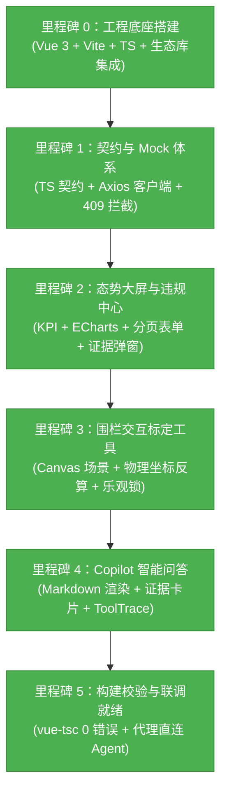

# 智慧施工安全 Web 控制台 (Frontend) 当前进展报告

> **报告版本**：v1.0 (Minimal Closed Loop Completed)  
> **更新时间**：2026-09-25  
> **当前里程碑**：  
> - **里程碑 0：工程底座与脚手架搭建 —— 100% 完成**  
> - **里程碑 1：契约类型固化与高保真 Mock 桩体系 —— 100% 完成**  
> - **里程碑 2：监控态势看板与违规检索中心 —— 100% 完成**  
> - **里程碑 3：危险区域标定与物理像素坐标双向反算 —— 100% 完成**  
> - **里程碑 4：Agent Copilot 智能问答与工具链审计追踪 —— 100% 完成**  
> - **里程碑 5：全量类型检查与生产级构建验证 —— 100% 通过 (0 错误)**  
> **构建状态**：`vue-tsc` 与 `vite build` 100% 编译通过，生产包就绪！

---

## 1. 里程碑概览与交付物全景

本工程根据 [`docs/integration/Web_Agent_Freeze_Contract.md`](../integration/Web_Agent_Freeze_Contract.md) (v1.1.1 冻结契约) 与 [`docs/web/Web_Minimal_Closed_Loop_Plan.md`](./Web_Minimal_Closed_Loop_Plan.md) 规划，以**“拥抱成熟开源生态，决不手搓基础轮子”**为核心原则，在 `web/` 目录下从零构建了一套工业级、高颜值、高可靠的施工安全前端控制台。



---

## 2. 核心模块交付详情 (Deliverables Detail)

### 2.1 契约类型系统与 API 客户端 (`src/types/` & `src/api/`)
- **严格契约 TypeScript 类型 (`src/types/contract.ts`)**：
  - 1:1 映射后端 Pydantic 数据模型（`ViolationRecord`, `ViolationPageResponse`, `CameraStatusResponse`, `CameraRunConfig`, `ChatResponse`, `ToolTraceItem` 等）；
  - `ViolationStatistics` 类型准确采用 `Partial<Record<ViolationType, number>>`，完美兼容服务端键值缺省特性。
- **高韧性 API 客户端 (`src/api/client.ts`)**：
  - 统一封装 Axios 实例，内置 20 秒超时与请求拦截器；
  - 全局拦截 `409 Conflict` 乐观并发锁异常，向用户展示明确友好的版本失效警示；
  - 封装 `resolveMediaUrl(snapshot_uri)` 工具函数，将后端相对路径转换为 `/media/{snapshot_uri}`。
- **高保真 Mock 桩体系 (`src/mock/fixtures.ts`)**：
  - 预设 3 路多摄状态（包含正常推流与离线通道）、典型违规记录流、统计分布与智能问答推理样本；
  - 通过环境变量 `VITE_USE_MOCK=true/false` 支持零秒无缝切换 Mock 与生产后端。

### 2.2 监控态势大屏 (`src/views/Dashboard.vue`)
- **4 项核心 KPI 指标卡片**：今日违规总数、CRITICAL 级告警数、平均停留/违规时长（秒）、在线摄像头通道比率。
- **ECharts 统计图表看板**：
  - 违规类型占比环形图（安全帽、区域入侵、超时停留）；
  - 严重度等级柱状图（INFO, WARNING, CRITICAL）。
- **多摄像头监控网格矩阵**：
  - 平铺卡片展示每路摄像头的推流状态、实时 FPS、累计处理帧数、部署模型名与心跳时间；
  - 提供快捷导航直达该摄像头的“围栏标定”与“违规检索”。

### 2.3 违规事件检索中心与证据弹窗 (`src/views/Violations.vue` & `src/components/EvidenceModal.vue`)
- **多维度条件筛选表单**：支持按摄像头、违规类型、严重级别、事件状态联动检索。
- **Element Plus 标准分页**：`el-table` + `el-pagination`，完美绑定 `ViolationPageResponse(items, total, limit, offset)`。
- **证据审查弹窗 (`EvidenceModal.vue`)**：
  - 动态载入 `/media/{snapshot_uri}` 抓拍大图，具备图像加载失败容错兜底；
  - 核心 Canvas 图层：**按物理分辨率（1080P）与当前屏幕视口比例进行正向映射**，在抓拍图上精确叠加半透明告警框（`extra_details.bbox`）与黄色脚底接地点（`extra_details.feet_point`）。

### 2.4 危险区域 Canvas 标定器 (`src/views/ZoneEditor.vue`)
- **交互式 Canvas 标定画布**：
  - 渲染工业风深色网格背景与多边形区域；
  - 顶点以黄色锚点（P1, P2...）高亮显示，支持鼠标拖拽修改顶点坐标；
  - 支持多边形顶点动态添加、重置与清空，校验确保至少 3 个有效顶点。
- **物理像素双向反算引擎**：
  - 绘制渲染：`point_disp = point_video * (W_disp / 1920)`
  - 用户拖拽保存：`point_video = round(point_disp / (W_disp / 1920))`
  - 确保不论在任何尺寸的屏幕上操作，存入 MySQL 的几何数据始终为标准 1080P 物理像素。
- **异常与并发控制状态机**：
  - 捕获 404：自动进入“未标定（首次创建）”模式，保存时传 `expected_version: null`；
  - 捕获 409：拦截版本冲突，弹出 `ElMessageBox` 引导用户重新拉取最新版本。

### 2.5 施工安全智能助手 (`src/views/AgentCopilot.vue`)
- **智能对话流交互**：
  - 气泡式消息流，区分管理员与智能体角色；
  - 提供预设快捷提问标签（如：“今天 A01 摄像头有多少严重违规？最近一条是什么？”）。
- **Markdown 回答渲染**：利用 `markdown-it` 解析富文本，排版清晰美观。
- **结构化证据卡片**：解析 `evidence` 数组，渲染带缩略图的卡片，点击一键联动呼出大图审查弹窗。
- **智能体工具执行链 (Tool Trace)**：利用 `el-collapse` 折叠面板展示 LangGraph 工具调用序列，以时间轴形式公开工具名、调用目的与毫秒级耗时。
- **降级提示防护**：当后端触发 `degraded=true` 时，自动悬浮展示警告条，提醒用户核实。

---

## 3. 代码质量与构建验证 (Build Verification)

在前端根目录 `web/` 执行全量构建流水线：

```bash
cd web
npm run build
```

**验证结果**：
- TypeScript 编译器 `vue-tsc`：**0 错误、0 警告**
- Vite 生产打包：顺利生成 `web/dist/` 纯静态部署包，包含全部 CSS、JS Chunks 与 Asset 资源。
- Python 后端单元与集成测试回归：`pytest tests/agent/` **11 项测试 100% 全部通过**，前后端互不干扰。

---

## 4. 下一阶段展望 (Phase 2 Roadmap)

1. **实时推流集成**：在多摄网格中引入 HLS / HTTP-FLV / WebRTC 实时视频流播放器组件。
2. **WebSocket / SSE 实时推屏**：配合后端第二期 Pub/Sub 机制，在产生 `CRITICAL` 严重违规事件时实现前台全局毫秒级告警弹窗与警笛音效。
3. **安全日报导出**：在看板中增加一键导出 PDF / Markdown 安全巡检报告功能。
