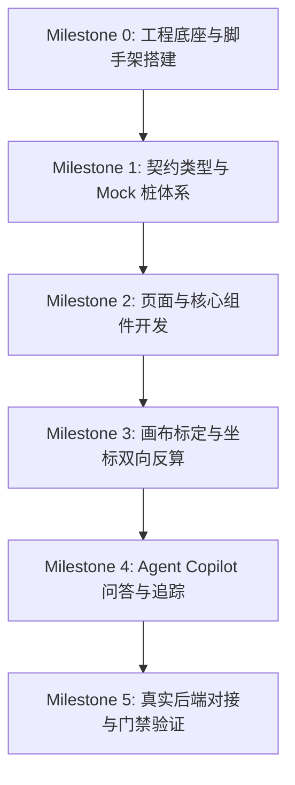

# Web 前端最小闭环开发计划 (Web Minimal Closed Loop Plan)

> **版本**：v1.0  
> **基准契约**：[`docs/integration/Web_Agent_Freeze_Contract.md`](../integration/Web_Agent_Freeze_Contract.md) (v1.1.3)
> **核心原则**：**拥抱成熟开源生态（Vue 3 + Element Plus + ECharts + Konva + markdown-it），决不手搓基础轮子；以契约驱动独立开发，实现无阻碍最小闭环。**

---

## 1. 最小闭环目标与验收场景 (Definition of MVP)

Web 前端最小闭环的目标是构建一套高颜值、高可用、工业级的智慧工地施工安全管理控制台，在 Agent 后端各接口逐步落地的过程中，前端**零阻塞**完成全部视觉交互，并在后端就绪后**一键切换接入**。

### 核心用户故事闭环（MVP 4 大主链路）
1. **看（全景看板）**：
   - 首页展示多摄像头矩阵（在线状态、实时 FPS、处理帧率）。
   - 呈现今日违规态势综合统计指标（总数、平均停留时长、类型分布饼图、严重级别柱状图）。
2. **查（违规中心）**：
   - 违规事件表格检索（多维度筛选、时间跨度、严重级别）。
   - 标准分页切换，点击列表项弹出“证据大图弹窗”，按视频原物理分辨率缩放后精确高亮目标框 (`bbox`) 与脚底接地点 (`feet_point`)。
3. **设（围栏标定）**：
   - 选择摄像头，从后端读取当前生效的危险区域配置（捕获 404 自动进入“首次标定”）。
   - 在基于 `Konva.js` 的 Canvas 画布上直观拖拽/添加多边形顶点，自动进行“画布屏幕像素 ⇄ 视频物理像素”双向反算。
   - 保存时提交 `expected_version`，如遇并发修改捕获 409 Conflict 友好提示刷新。
4. **问（Agent Copilot）**：
   - 右侧或独立抽屉呼出“施工安全智能助手”。
   - 支持自然语言提问（如“今天 A01 摄像头有多少严重违规？”），渲染 Markdown 格式回答。
   - 结构化渲染“依据事件快照卡片”，并以折叠面板展示智能体执行轨迹（`tool_trace`）。

---

## 2. 技术栈与生态依赖清单 (No Re-inventing Wheels)

| 依赖模块 | 选型包名 | 版本建议 | 承载功能 |
|---|---|---|---|
| **构建框架** | `vue` + `vite` + `typescript` | Vue 3.4+, Vite 5+ | 工程基座、TypeScript 强类型校验、极速 HMR |
| **基础 UI 库** | `element-plus` | 最新稳定版 | 中后台基础布局、Table、Pagination、Dialog、Form、Notification |
| **状态与路由** | `pinia` + `vue-router` | 最新版 | 全局相机与告警状态、SPA 页面路由 |
| **网络请求** | `axios` | 1.6+ | 统一封装拦截器、Vite 反向代理映射、409 拦截 |
| **数据可视化** | `echarts` + `vue-echarts` | ECharts 5+ | 违规类型分布、级别统计、监控 FPS 实时走势图 |
| **Canvas 标定** | `konva` + `vue-konva` | 最新版 | 2D 场景图、多边形锚点拖拽、视口缩放与高分屏适配 |
| **Markdown 对话** | `markdown-it` + `github-markdown-css` | 最新版 | Agent Copilot 智能回答富文本渲染、防 XSS |
| **通用工具库** | `@vueuse/core` | 10+ | 窗口自适应、本地存储、防抖节流 |
| **现代图标库** | `lucide-vue-next` / `@element-plus/icons-vue` | 最新版 | 仪表盘、监控、警告、证据等矢量图标 |

---

## 3. 详细任务分解与实施里程碑 (Milestones & Tasks)



### Milestone 0: 前端工程初始化与架构底座
- [ ] **M0.1 初始化工程目录**：在项目根目录初始化 `web/` 工程（`npm create vite@latest web -- --template vue-ts`）。
- [ ] **M0.2 安装成熟依赖**：安装 Element Plus、Pinia、Vue Router、ECharts、vue-konva、markdown-it、Axios、@vueuse/core 等。
- [ ] **M0.3 Vite 配置与代理**：
  - 配置 `@/` 路径别名指向 `src/`。
  - 配置 `server.proxy`：
    - `/api` 代理到 `http://127.0.0.1:8000`
    - `/media` 代理到 `http://127.0.0.1:8000`
- [ ] **M0.4 样式与主题重置**：引入 Element Plus 暗黑/工控主题或中后台全局样式，配置自适应视口。

### Milestone 1: 契约类型下发与完整 Mock 数据桩
- [ ] **M1.1 契约类型固化**：将 `Web_Agent_Freeze_Contract.md` 中的 TypeScript 契约写入 `web/src/types/contract.ts`。
- [ ] **M1.2 编写 Mock 数据桩 (`src/mock/fixtures.ts`)**：
  - 构造 3 路摄像头数据（2 在线、1 离线，FPS 25.0）。
  - 构造 20+ 条违规事件（包含未佩戴安全帽、吊装区入侵、超时停留，各带有效 `bbox` 与 `snapshot_uri`）。
  - 构造违规统计数据（按类型、按级别聚合）。
  - 构造真实相机危险区域（多边形像素顶点坐标）。
  - 构造 Agent Copilot 智能问答典型回答、证据卡片与工具轨迹。
- [ ] **M1.3 统一 API 客户端 (`src/api/client.ts`)**：
  - 封装 Axios 请求拦截器与响应拦截器。
  - 读取环境变量 `VITE_USE_MOCK=true/false`；为 `true` 时由本地 Mock 适配器直接返回数据，为 `false` 时只走 Vite 代理请求后端。两种模式严格互斥：真实请求失败必须抛出并提示，禁止回退或混用 Mock 数据。
  - 针对 `409 Conflict` 错误进行全局识别，抛出业务级异常。

### Milestone 2: 态势看板与违规检索列表
- [ ] **M2.1 全局布局架构 (`Layout/`)**：
  - 顶部导航栏：项目标题、当前系统时间（本地化格式）、网络模式指示器（Mock / 联调）。
  - 侧边栏：多摄监控大屏、违规事件中心、区域标定管理、安全智能助手。
- [ ] **M2.2 监控大屏 (`views/Dashboard/`)**：
  - 顶部 KPI 卡片：今日违规总数、严重违规数、平均停留时长。
  - 中部 ECharts 看板：违规分类分布饼图、严重等级占比柱状图。
  - 下部多摄矩阵卡片：网格化平铺展示摄像头编号、在线状态徽标、当前 FPS、最新心跳时间。
- [ ] **M2.3 违规中心 (`views/Violations/`)**：
  - 顶部查询过滤栏：相机筛选、违规类型下拉、严重级别下拉、时间范围选择器。
  - 核心表格展示：利用 `el-table` 展示事件时间、摄像头、类型 Tag、严重度 Tag、持续时间。
  - 分页组件集成：利用 `el-pagination` 绑定契约 `total, limit, offset`。
- [ ] **M2.4 证据大图弹窗组件 (`components/EvidenceModal.vue`)**：
  - 点击表格行或抓拍缩略图唤起弹窗。
  - 加载 `/media/{snapshot_uri}` 图片（`@error` 容错渲染占位符）。
  - 在大图上根据 `extra_details.bbox` 绘制半透明告警框，根据 `feet_point` 标记高亮脚底判定点。

### Milestone 3: 危险区域多边形标定工具 (Konva 驱动)
- [ ] **M3.1 标定工作台 (`views/ZoneEditor/`)**：
  - 相机选择与配置拉取（调用 `GET /api/v1/cameras/{id}/zones`）。
  - 捕获 404 处理：弹出提示并以默认模板（`zones: []`，1920×1080）进入首次创建模式。
  - 网络、鉴权或服务端错误不是首次创建条件；应保留当前配置并显示连接错误。
- [ ] **M3.2 基于 `vue-konva` 的画布标定交互**：
  - 载入相机最新静态帧或背景图作为画布底图。
  - 渲染已有多边形，并为每个顶点渲染可拖拽的控制锚点（Anchor Point）。
  - 支持“新建围栏”模式：在画布上连续点击打点，右键或闭合首点完成多边形创建。
  - 侧边配置面板：修改围栏名称、报警停留时长阈值（`alarm_dwell_threshold_seconds`）、启用开关。
- [ ] **M3.3 物理坐标系与视口缩放反算（核心数学逻辑）**：
  - 缩放比计算：`scaleX = canvasWidth / sourceWidth`, `scaleY = canvasHeight / sourceHeight`。
  - 渲染时正向映射，保存时除以缩放比取整转换为原始视频物理像素。
- [ ] **M3.4 乐观并发锁机制落地**：
  - 保存时仅提交实时 GET 成功读取到的 `expected_version`；仅 GET 404 的首次创建提交 `null`。
  - 若收到 `409 Conflict`，弹出 Element Plus `ElMessageBox` 警示窗：“配置已在其他终端更新，请重新获取最新版本”，一键刷新并重新加载。

### Milestone 4: 施工安全智能问答 Copilot (Chat)
- [ ] **M4.1 对话交互面板 (`views/AgentCopilot/` 或全局抽屉)**：
  - 滚动消息流列表，区分用户提问气泡与 Agent 智能体回答气泡。
  - 预设快捷提问标签（如：“今天 A01 摄像头有多少严重违规？”、“当前吊装区有哪些活跃告警？”）。
- [ ] **M4.2 Markdown 结论渲染**：
  - 使用 `markdown-it` 解析 `answer`，支持富文本、列表与代码块高亮。
- [ ] **M4.3 结构化证据卡片 (`components/EvidenceCard.vue`)**：
  - 解析 `ChatResponse.evidence` 列表。
  - 渲染证据缩略图、事件 UUID 与发生时间，点击可联动唤起 `EvidenceModal` 大图审查。
- [ ] **M4.4 工具调用链路可视化 (`components/ToolTrace.vue`)**：
  - 解析 `ChatResponse.tool_trace` 数组。
  - 使用 `el-collapse` 折叠面板展示“智能体思考与工具调用”，展开后以 `el-timeline` 时间轴展示：调用的工具名称、调用目的、执行成功状态与耗时（`duration_ms`）。
- [ ] **M4.5 降级提示条**：
  - 当 `degraded === true` 时，在气泡顶部展示黄色提示：“该回答由降级规则或离线缓存生成，请注意核实”。

### Milestone 5: 真实后端对接与联调门禁验收
- [ ] **M5.1 环境切换**：配置 `.env.production` 或修改 `.env.development` 为 `VITE_USE_MOCK=false`。
  - 确认实时模式不会显示任何 fixture 数据；Agent 不可用时应出现明确错误提示。
- [ ] **M5.2 执行门禁验证**：
  - **GATE-01**：多摄矩阵正常拉取 `GET /api/v1/cameras`。
  - **GATE-02**：违规列表检索、严重度筛选与分页加载顺畅。
  - **GATE-03**：证据大图通过 `/media/{snapshot_uri}` 加载无跨域阻碍。
  - **GATE-04**：围栏标定读取、首次创建与修改更新成功同步 MySQL。
  - **GATE-05**：模拟并发修改触发 409 拦截并正确刷新。
  - **GATE-06**：向真实 Agent 发起问答，正确解析 DeepSeek / Fake 模型的回答与工具轨迹。

---

## 4. 交付时间表与进度跟踪 (Execution Schedule)

```text
阶段                工作重点                                            交付物
---------------------------------------------------------------------------------------------------------
Day 1: 环境与底座   Vite + Vue 3 工程搭建、依赖集成、Mock 桩与 API 客户端    可运行的空白工程、完整 Mock 测试数据
Day 2: 看板与列表   多摄矩阵大屏、ECharts 态势统计、违规列表与证据大图弹窗   可体验的监控控制台与违规排查界面
Day 3: 围栏标定     Konva.js 画布多边形绘制、坐标正反双向映射、404/409处理   可在画布上自由标定并导出标准物理坐标
Day 4: 智能问答     Copilot 对话面板、Markdown 渲染、证据卡片与调用链       完整的智能体自然语言问答交互体验
Day 5: 联调与验收   对接真实 FastAPI 后端、跑通 GATE-01 至 GATE-06 门禁     高质量生产级前后端完整闭环
```

---

## 5. 前端运行与开发指令规范

```bash
# 1. 进入前端工程目录
cd web

# 2. 安装依赖
npm install

# 3. 启动开发服务器 (默认使用本地 Mock 桩)
npm run dev

# 4. 类型检查与生产构建
npm run build
```
